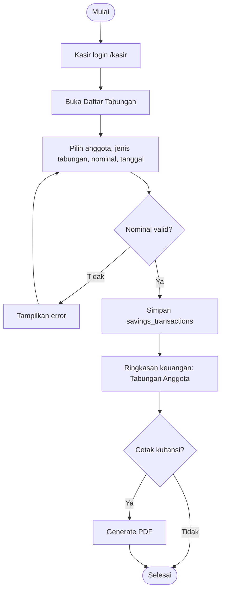
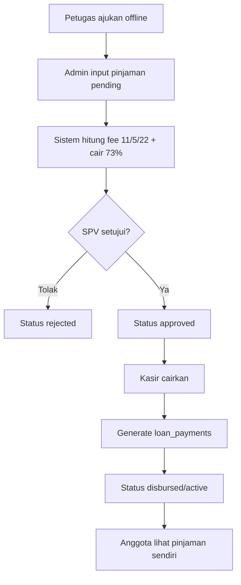
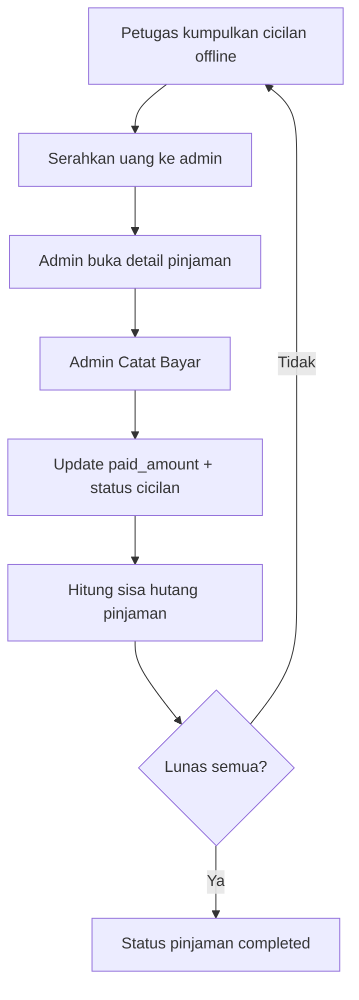

# Activity Diagram - Sistem Karya Tantri Abadi

Dokumen ini memodelkan alur kerja utama aplikasi **Karya Tantri Abadi** (scope simpan pinjam). Diagram memakai notasi flowchart Mermaid.

> Istilah: formal akademik = **simpanan**; UI/mitra = **tabungan**. Petugas lapangan = **offline**.

---

## Daftar Isi
1. Transaksi Tabungan
2. Pinjaman kelompok (input → approve → cair)
3. Cicilan (petugas offline → admin catat)
4. Login multi-panel

---

## 1. Activity Diagram: Transaksi Tabungan

Kasir mencatat tabungan anggota. Admin dapat memantau/edit. Anggota tidak mengelola tabungan di panel.



---

## 2. Activity Diagram: Pinjaman Kelompok



---

## 3. Activity Diagram: Cicilan



Kasir/SPV dapat **melihat** jadwal cicilan, tetapi tidak mencatat pembayaran.

---

## 4. Activity Diagram: Login Multi-panel

```mermaid
flowchart TD
    Start([Buka /auth/login]) --> Isi[Isi email dan password]
    Isi --> Valid{Valid?}
    Valid -- Tidak --> Error[Pesan error] --> Isi
    Valid -- Ya --> Role{Role?}
    Role -- admin --> Admin[/admin]
    Role -- spv --> SPV[/spv]
    Role -- kasir --> Kasir[/kasir]
    Role -- anggota --> Anggota[/anggota]
    Role -- legacy/lain --> LoginBack[Kembali ke login / tanpa panel]
```

Petugas tidak memiliki role aktif untuk login.

---

## Catatan non-scope

Diagram POS retail dan SHU **tidak disertakan** karena modul tersebut dinonaktifkan pada implementasi mitra Karya Tantri Abadi.
