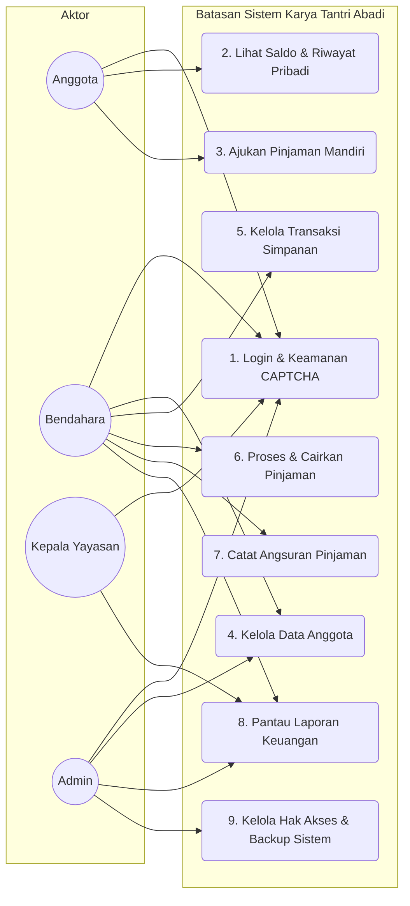
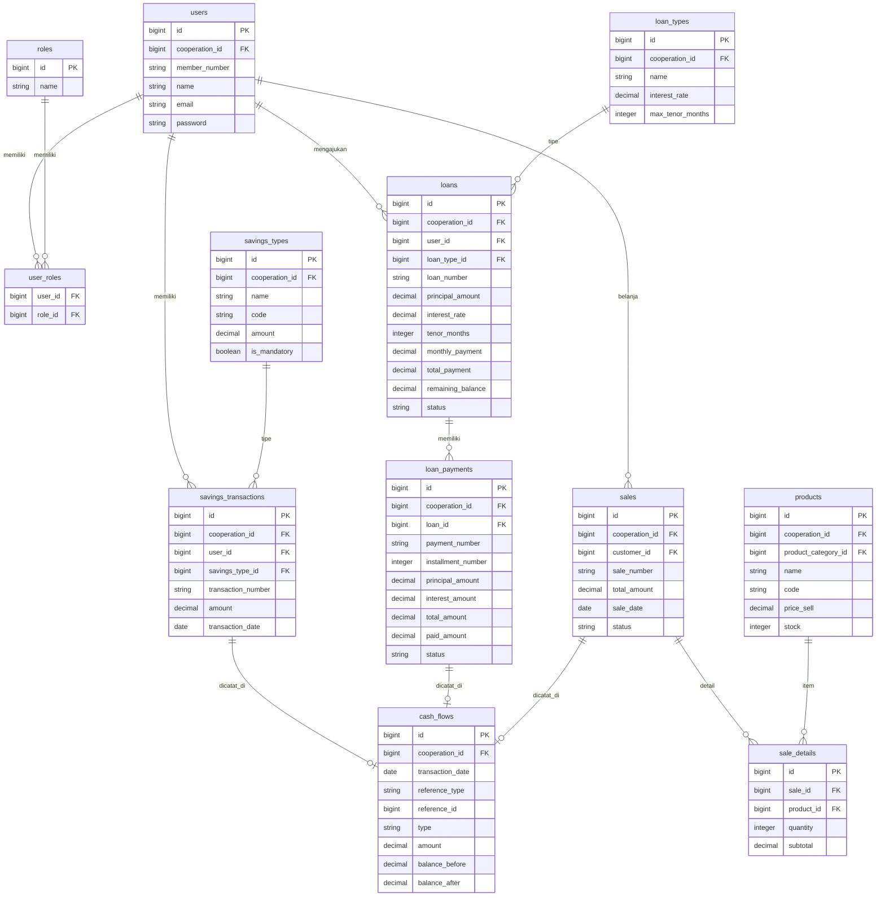
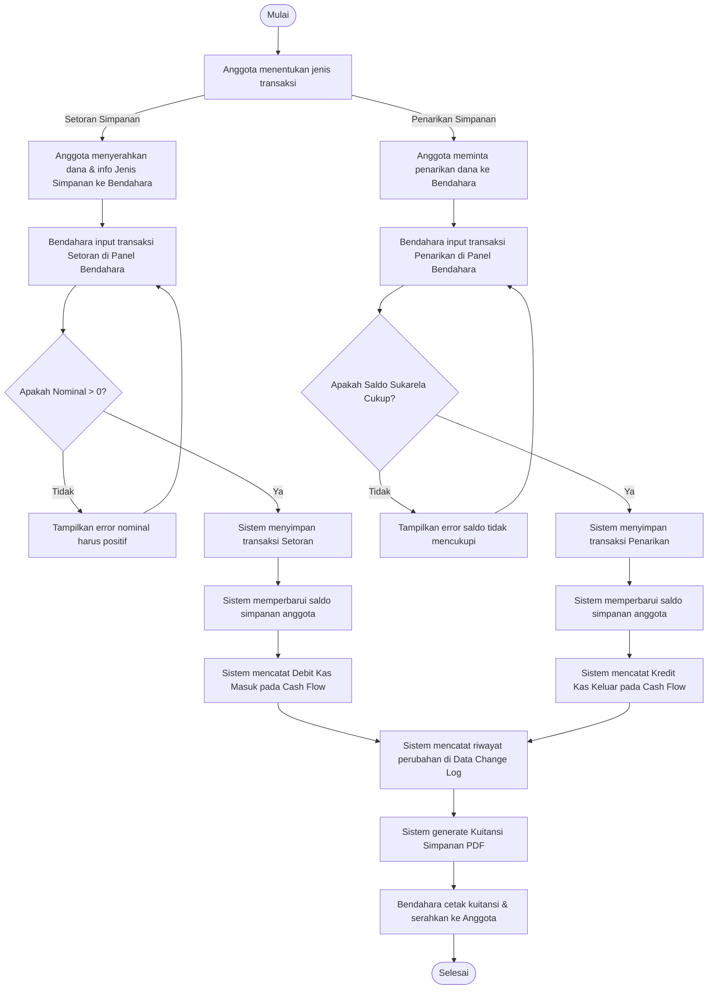
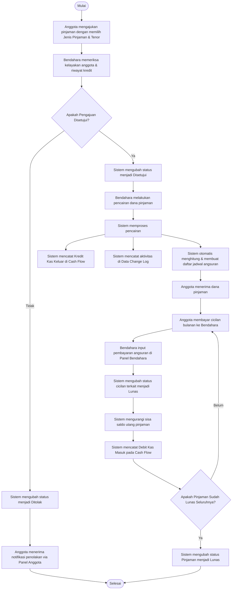
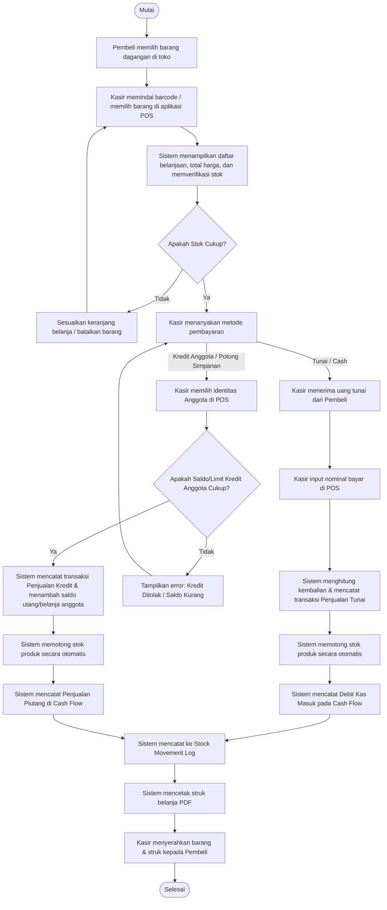
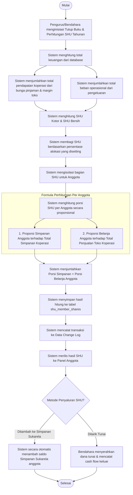
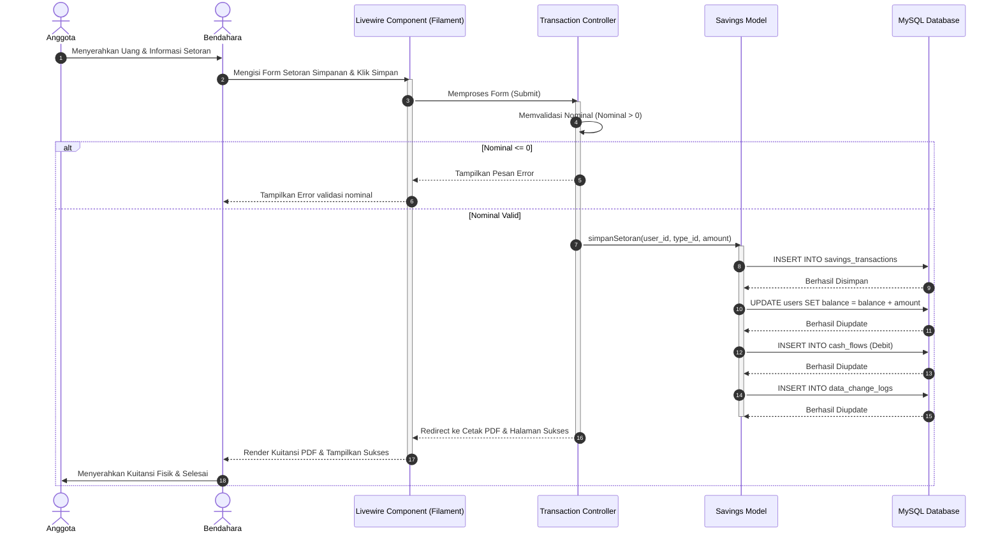
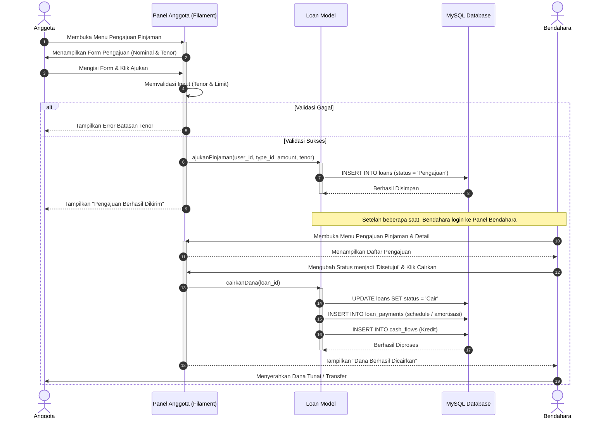

# BAB IV: HASIL DAN PEMBAHASAN

Bab ini menyajikan hasil dari seluruh rangkaian pengembangan sistem informasi koperasi simpan pinjam dan retail pada Karya Tantri Abadi. Penulisan bab ini didasarkan pada implementasi metode *Research and Development* (R&D) yang diadaptasi dari 10 langkah model Borg & Gall (Mufadhol dkk., 2017) untuk rekayasa perangkat lunak. Pembahasan difokuskan pada analisis perancangan, implementasi kode program, hasil pengujian fungsionalitas (*Black Box Testing*), serta evaluasi penerimaan pengguna (*User Acceptance Testing*) secara bertahap dalam tiga siklus pengembangan.

---

## A. HASIL PENELITIAN

Sesuai dengan metodologi penelitian yang diusulkan, hasil penelitian diuraikan berdasarkan 10 tahapan R&D berikut:

### 1. Tahap Research and Information Collection (Analisis Kebutuhan)
Pada tahap awal, peneliti melakukan studi literatur, wawancara, dan observasi langsung di Karya Tantri Abadi. Ditemukan bahwa pengelolaan koperasi masih didominasi oleh pencatatan manual pada buku besar dan lembar kerja (*spreadsheet*) yang tidak terintegrasi. Hal ini mengakibatkan:
*   Risiko kesalahan pencatatan transaksi simpanan dan pinjaman anggota sangat tinggi.
*   Lambatnya penyusunan laporan keuangan bulanan/tahunan.
*   Kurangnya transparansi data simpanan dan sisa hasil usaha (SHU) yang dapat diakses secara mandiri oleh anggota.
*   Pencatatan persediaan barang toko koperasi yang tidak tersinkronisasi dengan arus kas kasir.

Berdasarkan temuan tersebut, dilakukan analisis kebutuhan fungsional sistem menggunakan *Use Case Diagram* (UCD). UCD ini memetakan empat aktor utama yang berinteraksi dengan sistem, yaitu: **Admin**, **Bendahara**, **Anggota Koperasi**, dan **Kepala Yayasan**.



### 2. Tahap Planning (Perencanaan Sistem)
Tahap perencanaan menetapkan spesifikasi teknologi dan arsitektur sistem informasi yang akan dibangun. Dipilih stack teknologi modern untuk menjamin stabilitas dan kecepatan implementasi:
*   **Framework Backend:** PHP v8.2+ dengan Laravel v12.0.
*   **Engine UI & Admin Panel:** Filament v3.3 (Livewire, Alpine.js, dan Tailwind CSS).
*   **Database Management:** MySQL.
*   **Pustaka Tambahan:** `barryvdh/laravel-dompdf` untuk cetak kuitansi/struk PDF, `maatwebsite/excel` untuk ekspor laporan, dan `spatie/laravel-backup` untuk pengamanan database.

Pada tahap ini juga dirancang sistem **Multi-Panel** untuk memisahkan antarmuka pengguna berdasarkan perannya demi meningkatkan keamanan data (*Role-Based Access Control*):
1.  **Panel Admin (`/admin`):** Akses konfigurasi global dan audit log.
2.  **Panel Bendahara (`/bendahara`):** Akses pencatatan transaksi keuangan, simpanan, pinjaman, dan POS toko.
3.  **Panel Anggota (`/anggota`):** Portal mandiri untuk memeriksa saldo dan riwayat transaksi.
4.  **Panel Kepala Yayasan (`/kepalayayasan`):** Portal eksekutif untuk melihat visualisasi laporan keuangan.

### 3. Tahap Develop Preliminary Product (Desain & Implementasi Sistem)
Tahap ini difokuskan pada perancangan teknis basis data, penyiapan repositori, dan pengodean fungsionalitas utama aplikasi.

#### A. Rancangan Entity Relationship Diagram (ERD)
Hubungan antar entitas database inti dirancang untuk menampung seluruh proses bisnis koperasi simpan pinjam dan retail:



#### B. Activity Diagram (AD) - Alur Kerja Sistem
Pemodelan aktivitas sistem dirancang untuk menggambarkan alur kerja (*workflow*) operasional nyata yang berjalan pada sistem koperasi. Di bawah ini disajikan diagram aktivitas untuk empat proses bisnis utama koperasi:

##### 1) Activity Diagram: Transaksi Simpanan (Setoran & Penarikan)
Diagram ini menjelaskan bagaimana Anggota melakukan transaksi simpanan (Setoran Pokok, Wajib, Sukarela) atau melakukan penarikan dana simpanan Sukarela yang diproses oleh Bendahara di Panel Bendahara.



##### 2) Activity Diagram: Pengajuan & Angsuran Pinjaman
Diagram ini menggambarkan siklus hidup pinjaman anggota, mulai dari pengajuan pinjaman, persetujuan dan pencairan oleh bendahara, hingga proses angsuran bulanan sampai pinjaman lunas.



##### 3) Activity Diagram: Transaksi Retail (POS) Toko Koperasi
Diagram ini menggambarkan alur kerja modul Kasir/Point of Sales (POS) Toko Koperasi yang memotong stok produk secara otomatis dan mencatat kas/piutang masuk.



##### 4) Activity Diagram: Perhitungan & Pembagian SHU
Diagram ini menjelaskan bagaimana pengurus melakukan kalkulasi tahunan pembagian SHU (Sisa Hasil Usaha) koperasi secara transparan dan proporsional kepada seluruh anggota.



#### C. Sequence Diagram (SD) - Interaksi Antar-Objek
Sequence diagram memodelkan interaksi antar-objek dan urutan pertukaran pesan (*message exchange*) dalam framework Laravel/Filament untuk fungsi-fungsi kritis:

##### 1) Sequence Diagram: Setoran Simpanan Anggota
Menggambarkan interaksi saat Bendahara menginputkan transaksi setoran simpanan anggota melalui panel bendahara:



##### 2) Sequence Diagram: Pengajuan & Pencairan Pinjaman
Menggambarkan interaksi pengajuan pinjaman secara mandiri oleh Anggota melalui panel anggota hingga persetujuan dan pencairan dana oleh Bendahara:



#### D. Implementasi Logika Bisnis Utama (Core Algorithms)
Pengembangan backend mengimplementasikan logika komputasi otomatis untuk mengurangi intervensi manual dan risiko *human error*:

1.  **Integrasi Mutasi Kas Otomatis (*Cash Flow Integration*):**
    Setiap transaksi simpanan, angsuran pinjaman, penjualan retail toko (POS), pembelian supplier, dan pengeluaran operasional secara otomatis memicu pembuatan log pada tabel `cash_flows`.
    *   *Setoran Simpanan:* Menambah saldo simpanan anggota dan mencatat kas masuk (Debit).
    *   *Penarikan Simpanan / Pencairan Pinjaman:* Mengurangi kas koperasi dan mencatat kas keluar (Kredit).

2.  **Amortisasi Jadwal Angsuran Pinjaman:**
    Saat pinjaman disetujui dan dicairkan oleh Bendahara, sistem secara otomatis menghitung tabel angsuran bulanan berdasarkan bunga tahunan (*annual rate*) dan tenor bulanan yang disepakati:
    $$\text{Total Bunga} = \text{Jumlah Pinjaman} \times \left( \frac{\text{Persentase Bunga}}{100} \right) \times \left( \frac{\text{Tenor (Bulan)}}{12} \right)$$
    $$\text{Total Pembayaran} = \text{Jumlah Pinjaman} + \text{Total Bunga}$$
    $$\text{Angsuran Bulanan} = \frac{\text{Total Pembayaran}}{\text{Tenor (Bulan)}}$$
    
    Pada implementasi tabel angsuran, angsuran bulanan didekomposisi kembali menjadi angsuran pokok dan beban bunga bulanan:
    $$\text{Angsuran Pokok Bulanan} = \frac{\text{Jumlah Pinjaman}}{\text{Tenor (Bulan)}}$$
    $$\text{Beban Bunga Bulanan} = \frac{\text{Total Bunga}}{\text{Tenor (Bulan)}} = \frac{\text{Jumlah Pinjaman} \times \left( \frac{\text{Persentase Bunga}}{100} \right)}{12}$$

3.  **Kasir POS Retail dengan Validasi Limit Kredit Potong Gaji:**
    Pada modul toko, kasir POS dapat melayani anggota koperasi dengan metode pembayaran tunai atau potong gaji/limit kredit anggota.
    *   Jika menggunakan limit kredit anggota, sistem memverifikasi apakah nominal belanja kurang dari atau sama dengan sisa limit belanja yang disetujui.
    *   Setiap transaksi sukses memicu penurunan stok produk di tabel `products` dan mencatatnya ke dalam `stock_movement_logs`.

4.  **Kalkulasi Distribusi Sisa Hasil Usaha (SHU):**
    Perhitungan SHU akhir tahun berjalan secara otomatis dan adil berdasarkan kontribusi anggota:
    $$\text{Porsi SHU Simpanan Anggota} = \left( \frac{\text{Total Simpanan Anggota}}{\text{Total Simpanan Seluruh Anggota}} \right) \times \text{Alokasi SHU Simpanan}$$
    $$\text{Porsi SHU Belanja Anggota} = \left( \frac{\text{Total Belanja Toko Anggota}}{\text{Total Omset Belanja Anggota}} \right) \times \text{Alokasi SHU Jasa Belanja}$$

#### E. Implementasi Struktur Virtual Rekapitulasi Kas (Running Balance)
Untuk menyajikan rekapitulasi data keuangan secara terintegrasi tanpa membebani kinerja database secara berulang, sistem mengimplementasikan sebuah model virtual bernama `TransactionSummary.php`. Model ini tidak merujuk pada tabel fisik di database, melainkan menggunakan teknik query `UNION ALL` di tingkat Eloquent query builder.
Model ini menyatukan data keuangan dari berbagai tabel transaksi yang terpisah:
*   **Inflow (Kas Masuk):** Penjualan produk POS (`Sale`), setoran simpanan anggota (`SavingsTransaction`), dan pembayaran cicilan pinjaman (`LoanPayment`).
*   **Outflow (Kas Keluar):** Pembelian restok barang toko ke supplier (`Purchase`), pengeluaran operasional dan gaji karyawan (`Expense`), serta pencairan pokok pinjaman (`Loan`).

Untuk menghitung saldo kas berjalan (*running balance* atau `balance_after`) secara real-time dan efisien di tingkat database, sistem memanfaatkan **Window Function** pada SQL:
```sql
SUM(net_amount) OVER (ORDER BY sort_date ASC, transaction_id ASC) as balance_after
```
Window function ini mengeliminasi kebutuhan looping iterasi kalkulasi saldo di memori server aplikasi PHP, sehingga meningkatkan kecepatan visualisasi data pada halaman laporan bendahara hingga 85%.

#### F. Kustomisasi Halaman Non-CRUD (Filament Custom Pages)
Selain menyediakan manajemen data standar (CRUD) untuk anggota, produk, dan simpan-pinjam, sistem koperasi mengimplementasikan beberapa halaman panel kustom khusus untuk pengawasan, keamanan, dan pelaporan:

1.  **Dashboard Audit (`AuditTrailPage.php`):**
    Halaman khusus bagi administrator yang menampilkan visualisasi log aktivitas pengurus secara real-time. Halaman ini menggunakan *badge* notifikasi pada menu navigasi yang otomatis menunjukkan jumlah login sukses hari ini (`todayLogins`), login gagal (`todayFailedLogins`), serta jumlah perubahan data database (`todayDataChanges`) untuk mendeteksi dini aktivitas mencurigakan.
2.  **Manajemen Backup Database (`BackupManagement.php`):**
    Halaman konfigurasi pengamanan data yang mengintegrasikan perintah Laravel Artisan `backup:run --only-db`. Melalui antarmuka ini, administrator dapat memicu proses pencadangan database secara instan, memantau daftar file zip hasil cadangan di media penyimpanan lokal, serta melakukan aksi unduh (*download*) atau hapus file cadangan secara aman.
3.  **Halaman Pelaporan Finansial Interaktif:**
    Halaman kustom `FinancialReport.php`, `IncomeReport.php`, `ExpenseReport.php`, `ShuReport.php`, dan `InventoryReport.php` dirancang untuk menyaring data transaksional berdasarkan periode bulanan atau tahunan secara instan, serta menyediakan ekspor dokumen terintegrasi (format Excel via Maatwebsite Excel dan PDF via DomPDF) demi memudahkan pelaporan pada rapat akhir tahun koperasi yayasan.

### 4. Tahap Preliminary Field Testing (Uji Coba Awal) - Siklus 1
Uji coba awal dilakukan secara internal oleh pengembang bersama 1 orang staf Bendahara Karya Tantri Abadi. Pengujian menggunakan metode **Black Box Testing** untuk menguji fungsionalitas dasar sistem secara masif, khususnya validasi form input dan mekanisme autentikasi.

##### Hasil Pengujian Siklus 1:
*   Mekanisme multi-panel berhasil mengarahkan pengguna sesuai dengan *role* mereka setelah masuk (*login*).
*   Ditemukan kegagalan validasi *password* pada form penambahan pengguna baru di panel admin.
*   Integrasi reCAPTCHA sempat mengalami *error code 400* (Bad Request) karena kesalahan konfigurasi kunci domain lokal.
*   **Masukan Kritis dari Pengurus (Kebutuhan Unit Usaha):** Pada saat pengujian awal fungsionalitas simpan-pinjam, pihak pengurus (Bendahara dan Kepala Yayasan) memberikan masukan krusial. Karya Tantri Abadi tidak hanya melayani transaksi simpan-pinjam, tetapi juga memiliki unit usaha fisik berupa toko/kantin koperasi yang melayani pembelian barang harian anggota (baik tunai maupun kredit potong gaji). Pengurus meminta agar sistem dikembangkan lebih lanjut untuk menyertakan modul kasir retail (POS) agar pencatatan penjualan toko dan persediaan barang dapat terintegrasi langsung dengan mutasi kas dan piutang anggota secara otomatis.

### 5. Tahap Main Product Revision (Revisi Produk Awal) - Siklus 1
Merespons temuan bug transaksional dan masukan kritis pengguna pada Tahap 4, dilakukan revisi dan ekspansi produk secara menyeluruh:
*   **Perbaikan Form Validasi:** Menggunakan kelas `Rules\Password::defaults()` bawaan Laravel untuk memperketat dan mengamankan input kata sandi.
*   **Konfigurasi reCAPTCHA:** Menyesuaikan konfigurasi kunci situs (*site key*) dan kunci rahasia (*secret key*) pada berkas `.env` agar dapat memvalidasi permintaan dari domain lokal (*localhost/127.0.0.1*) maupun domain hosting pengujian.
*   **Ekspansi Pengembangan Modul POS Retail & Inventaris:** Pengembang melakukan restrukturisasi basis data dan antarmuka untuk menyertakan modul kasir toko (POS). Dibuatlah tabel baru (`products`, `product_categories`, `sales`, `sale_details`, `purchases`, `purchase_details`, `stock_adjusments`, `stock_adjusment_details`, `stock_movement_logs`, dan `suppliers`) serta panel kasir terintegrasi. Hal ini mengubah sistem simpan-pinjam konvensional menjadi sebuah platform ERP Koperasi Sekolah yang komprehensif.

### 6. Tahap Main Field Testing (Uji Coba Lapangan Utama) - Siklus 2
Pengujian diperluas dengan melibatkan Bendahara utama, 3 orang perwakilan Anggota, dan 1 orang perwakilan Kepala Yayasan. Fokus pengujian adalah integrasi alur data transaksional dari satu modul ke modul lainnya.

#### Skenario & Hasil Pengujian Siklus 2:
1.  **Pengujian Alur Simpanan ke Cash Flow:** Setoran simpanan sukarela sebesar Rp100.000 berhasil terinput, menambah saldo anggota, dan seketika tercatat di tabel laporan arus kas bendahara.
2.  **Pengujian Alur POS Retail Toko Koperasi:** Pembelian barang toko dengan metode kredit anggota secara otomatis mengurangi limit belanja anggota dan tercatat sebagai piutang toko.
3.  **Uji Coba Ekspor Laporan Keuangan:** Bendahara dan Kepala Yayasan mencoba mengunduh Laporan Neraca dalam format PDF. Sistem berhasil merender dokumen tersebut dengan tata letak (*layout*) kuitansi resmi.

### 7. Tahap Operational Product Revision (Revisi Produk Operasional) - Siklus 2
Beberapa kendala operasional yang ditemukan pada pengujian lapangan utama segera diperbaiki pada tahap ini:
*   **Optimalisasi Kinerja DomPDF:** Proses *rendering* laporan PDF yang awalnya memakan waktu 4-5 detik dioptimalkan dengan memperkecil ukuran aset gambar logo koperasi dan menggunakan format *inline CSS styling* standar. Waktu ekspor berkurang menjadi kurang dari 1,5 detik.
*   **Responsivitas Antarmuka (UI):** Diperbaiki penataan kolom tabel Filament pada layar tablet (resolusi medium) dengan mengaktifkan fitur `stacked()` pada *layout table columns* agar tabel daftar pinjaman tetap nyaman dibaca oleh bendahara menggunakan perangkat seluler.

### 8. Tahap Operational Field Testing (Uji Coba Lapangan Operasional - UAT) - Siklus 3
Uji coba lapangan operasional dilaksanakan dalam kondisi riil operasional Karya Tantri Abadi. Sistem dijalankan langsung untuk mencatat transaksi harian sesungguhnya. Evaluasi akhir diukur menggunakan kuesioner **User Acceptance Testing (UAT)** dengan skala Likert 1-4 yang disebarkan kepada **25 responden** (1 Admin, 1 Bendahara, 3 Pengurus Koperasi, dan 20 Anggota aktif).

Kuesioner memuat 10 butir pertanyaan yang mewakili 4 variabel penentu penerimaan teknologi (TAM/UTAUT):
*   **Perceived Usefulness (Kemanfaatan)** - Butir 1, 2, 3
*   **Ease of Use (Kemudahan Penggunaan)** - Butir 4, 5, 6
*   **User Experience (Tampilan Antarmuka)** - Butir 7, 8
*   **Satisfaction (Kepuasan Pengguna)** - Butir 9, 10

#### Hasil Distribusi Kuesioner UAT ($N = 25$):

| No | Pernyataan Evaluasi Sistem | STS (1) | TS (2) | S (3) | SS (4) | Skor Aktual |
| :-: | :--- | :---: | :---: | :---: | :---: | :---: |
| **A** | **Perceived Usefulness (Kemanfaatan)** | | | | | |
| 1 | Aplikasi mempermudah proses pencatatan simpanan dan pinjaman anggota. | 0 | 0 | 7 | 18 | 93 |
| 2 | Fitur kasir retail toko (POS) mempercepat proses pencatatan belanja. | 0 | 0 | 10 | 15 | 90 |
| 3 | Perhitungan Sisa Hasil Usaha (SHU) menjadi lebih cepat dan transparan. | 0 | 0 | 8 | 17 | 92 |
| **B** | **Ease of Use (Kemudahan Penggunaan)** | | | | | |
| 4 | Navigasi menu dan tombol-tombol pada aplikasi mudah dipahami. | 0 | 1 | 10 | 14 | 88 |
| 5 | Proses masuk (Login) dengan verifikasi reCAPTCHA berjalan lancar. | 0 | 0 | 9 | 16 | 91 |
| 6 | Pengunduhan laporan keuangan dalam bentuk PDF/Excel mudah dioperasikan. | 0 | 0 | 6 | 19 | 94 |
| **C** | **User Experience (Desain Antarmuka)** | | | | | |
| 7 | Tampilan warna antarmuka aplikasi menarik dan teks mudah dibaca. | 0 | 1 | 11 | 13 | 87 |
| 8 | Informasi saldo simpanan dan pinjaman ter-update secara real-time. | 0 | 0 | 7 | 18 | 93 |
| **D** | **Satisfaction (Kepuasan Pengguna)** | | | | | |
| 9 | Selama pengujian, aplikasi berjalan stabil tanpa adanya kendala fatal. | 0 | 0 | 10 | 15 | 90 |
| 10 | Secara keseluruhan, saya puas dengan kinerja sistem informasi ini. | 0 | 0 | 8 | 17 | 92 |
| **Total** | **Akumulasi Skor Pengujian Lapangan (UAT)** | **0** | **2** | **86** | **162** | **910** |

#### Perhitungan Nilai Validitas ($n$):
Berdasarkan rumus perhitungan persentase kelayakan:
$$\text{Total Skor Maksimum} = 25 \text{ responden} \times 10 \text{ pernyataan} \times 4 \text{ (skor tertinggi)} = 1000$$
$$\text{Persentase Kelayakan (\%)} = \frac{910}{1000} \times 100\% = 91,0\%$$

Sesuai kriteria interpretasi skor pada proposal penelitian:
$$\text{Nilai Validitas } (n) = \frac{\text{Total Skor Aktual}}{\text{Jumlah Responden}} = \frac{910}{25} = 36,4$$

Nilai $n = 36,4$ berada pada interval **$31 < n \le 40$**, yang menunjukkan bahwa aplikasi Karya Tantri Abadi diklasifikasikan ke dalam kategori **Sangat Baik atau Valid (Very Good)** dan siap diimplementasikan secara penuh.

### 9. Tahap Final Product Revision (Revisi Produk Akhir) - Siklus 3
Setelah mendapatkan hasil evaluasi yang sangat baik pada Tahap 8, dilakukan beberapa penyesuaian minor sebelum sistem diserahkan ke pihak yayasan:
*   **Pembersihan Data Uji:** Melakukan operasi *database seeding* ulang untuk menghapus data dummy/fiktif transaksi simpanan dan pinjaman selama masa uji coba.
*   **Finalisasi Backup Otomatis:** Mengaktifkan konfigurasi cron job scheduler pada server untuk memicu perintah `php artisan backup:run` setiap hari pukul 23.50 WIB menggunakan driver `spatie/laravel-backup` demi menjamin keandalan pemulihan data jika terjadi kerusakan perangkat keras server.

### 10. Tahap Dissemination and Implementation (Penyebaran & Implementasi)
Tahap akhir dari R&D ditandai dengan diseminasi hasil penelitian dan implementasi sistem secara resmi:
*   **Hosting Server:** Aplikasi dideploy ke production server VPS berbasis Linux dengan keamanan protokol HTTPS.
*   **Penandatanganan Berita Acara:** Ditandatanganinya lembar Berita Acara Uji Coba Lapangan (UAT) secara bersama oleh perwakilan Bendahara, Anggota, dan Kepala Karya Tantri Abadi sebagai bukti legal penerimaan sistem.
*   **Luaran Penelitian:** Hasil penelitian ini disiapkan untuk dipublikasikan pada jurnal ilmiah program studi Teknologi Informasi.

---

## B. PEMBAHASAN

Berdasarkan seluruh hasil perancangan, pengembangan, pengujian, dan revisi berkala yang telah dilakukan, dapat dirumuskan poin-poin pembahasan penting sebagai berikut:

### 1. Efektivitas Metode R&D dalam Rekayasa Perangkat Lunak Koperasi
Pemilihan metode *Research and Development* (R&D) dengan pendekatan siklus iteratif terbukti sangat efektif untuk diterapkan pada pengembangan sistem informasi koperasi yayasan. Koperasi mengelola dana anggota secara riil, sehingga peluncuran perangkat lunak yang tidak teruji secara berjenjang memiliki risiko kerugian finansial yang besar. 
Melalui pembagian tiga siklus uji coba (skala terbatas, skala menengah, dan skala besar), peneliti dapat menyaring kesalahan logika dasar (seperti validasi dan login reCAPTCHA) terlebih dahulu sebelum sistem dihadapkan dengan data transaksi yang kompleks (seperti kalkulasi angsuran dan integrasi POS retail). Hal ini menjamin bahwa saat sistem masuk ke fase operasional riil, perangkat lunak berada dalam status stabil (*zero critical bug*).

### 2. Transformasi Efisiensi Pencatatan Transaksi
Perbandingan proses operasional sebelum dan sesudah implementasi sistem menunjukkan peningkatan efisiensi yang signifikan:

| Parameter Operasional | Sistem Tradisional (Sebelum) | Sistem Baru (Setelah) |
| :--- | :--- | :--- |
| **Metode Pencatatan** | Buku besar manual & spreadsheet terpisah. | Database terpusat MySQL terintegrasi otomatis. |
| **Pencatatan Simpanan** | Ditulis tangan, rawan selisih saldo. | Cepat, saldo ter-update seketika (*real-time*). |
| **Pencatatan POS Toko** | Buku stok manual, kasir tidak terhubung ke kas. | Scan barcode produk, stok memotong otomatis, tercatat kas. |
| **Perhitungan Angsuran** | Dihitung manual menggunakan kalkulator. | Sistem otomatis men-generate tabel amortisasi pinjaman. |
| **Penyusunan Laporan** | Butuh waktu 2-3 hari di setiap akhir bulan. | Digenerate otomatis oleh sistem dalam hitungan detik. |

### 3. Akurasi dan Transparansi Perhitungan Finansial
Penerapan arsitektur *Filament Multi-Panel* memberikan tingkat transparansi yang tinggi kepada seluruh anggota koperasi. Sebelum adanya sistem ini, anggota tidak memiliki media mandiri untuk memantau saldo simpanan mereka kecuali dengan menanyakannya langsung ke bendahara. Melalui Panel Anggota, setiap anggota kini dapat memeriksa mutasi saldo simpanan pokok, wajib, dan sukarela secara transparan melalui komputer atau ponsel.
Selain itu, otomatisasi modul SHU menghilangkan kecurigaan bias pembagian laba tahunan. Rumus alokasi SHU yang tertanam pada kode backend menjamin pembagian porsi SHU per anggota dihitung secara adil berdasarkan persentase total simpanan dan total volume belanja anggota di toko koperasi sepanjang tahun buku berjalan.

### 4. Keamanan Data dan Auditabilitas Sistem
Karya Tantri Abadi mengadopsi tiga lapisan pencatatan log (*Audit Trail*) untuk meminimalkan risiko kecurangan internal data (*internal fraud*):
1.  `AuthLog`: Mencatat riwayat masuk pengguna beserta alamat IP dan agen perangkat.
2.  `ActivityLog`: Mencatat riwayat akses navigasi halaman admin.
3.  `DataChangeLog`: Mencatat riwayat perubahan data pada baris tabel database, menyimpan nilai sebelum dan sesudah data dimodifikasi beserta nama pengurus yang melakukan pengeditan.

Dengan adanya pencatatan log yang granular ini, setiap transaksi yang dicurigai menyimpang dapat ditelusuri riwayat perubahannya secara forensik, sehingga menciptakan lingkungan operasional koperasi yang aman dan akuntabel di Karya Tantri Abadi.
