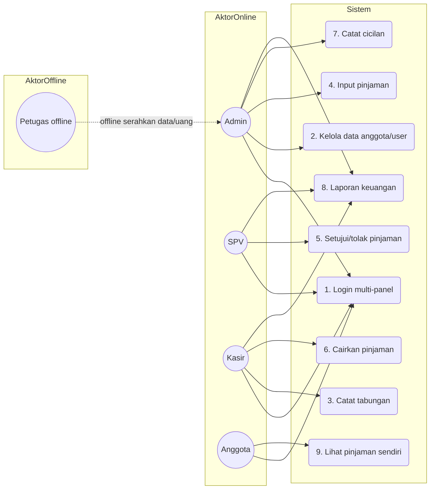
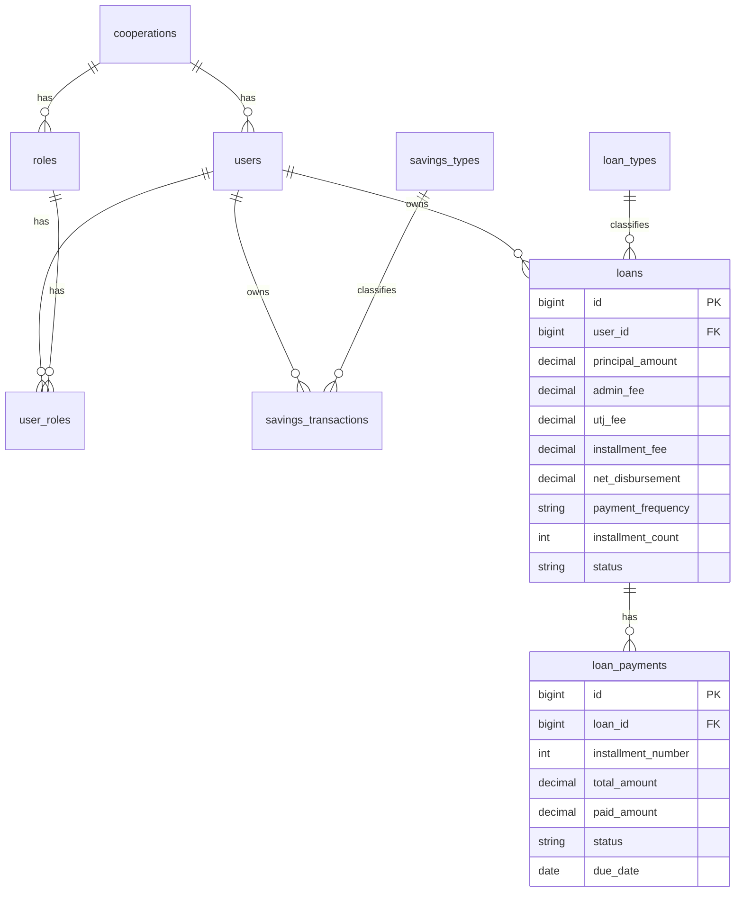
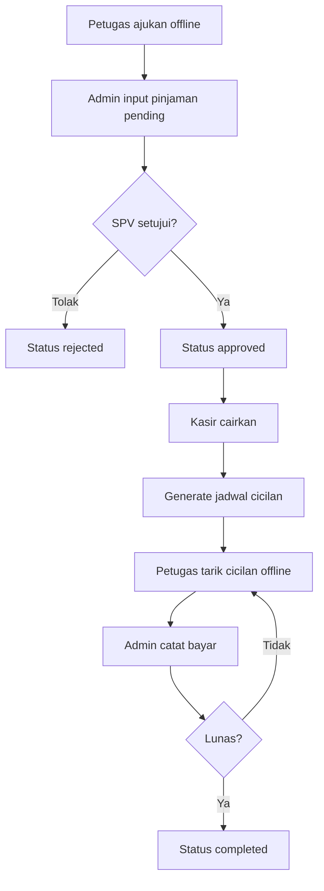
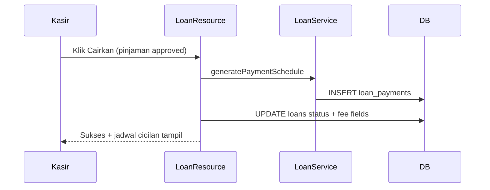

# BAB 4 HASIL DAN PEMBAHASAN

Bab ini menyajikan hasil pengembangan sistem informasi koperasi simpan pinjam berbasis website pada mitra **Karya Tantri Abadi**. Penulisan mengikuti metode *Research and Development* (R&D) yang diadaptasi dari model Borg & Gall (Mufadhol dkk., 2017). Pembahasan difokuskan pada analisis kebutuhan, perancangan, implementasi, pengujian fungsional (*Black Box Testing*), serta evaluasi penerimaan pengguna (*User Acceptance Testing*).

**Catatan istilah.** Secara formal akademik, modul dana anggota disebut **simpanan**. Mitra menyebutnya **tabungan** karena menyerupai menabung. Sistem menampilkan label **Tabungan**, sementara domain kode tetap `savings`. Judul skripsi tetap memakai kerangka *simpan pinjam*.

---

## 4.1 Hasil Penelitian

Hasil penelitian diuraikan mengikuti 10 tahapan R&D pada subbab 4.1.1 sampai 4.1.10.

### 4.1.1 Research and Information Collection (Analisis Kebutuhan)

Studi literatur, wawancara, dan observasi pada Karya Tantri Abadi menunjukkan pengelolaan masih mengandalkan pencatatan manual/*spreadsheet* yang tidak terintegrasi. Temuan utama:

1. Risiko kesalahan pencatatan tabungan (simpanan) dan pinjaman tinggi.
2. Penyusunan laporan lambat karena data tersebar.
3. Transparansi data pinjaman bagi anggota rendah (harus menanyakan pengelola).
4. Alur lapangan (petugas mencari nasabah dan menarik cicilan) berjalan offline dan belum tercatat rapi di sistem.

#### a. Aktor sistem

| Aktor | Status | Peran |
| :--- | :--- | :--- |
| Admin | user sistem | input pinjaman, catat cicilan, kelola data, pantau tabungan & laporan |
| SPV | user sistem | setujui/tolak pinjaman, pantau laporan |
| Kasir | user sistem | cairkan pinjaman, catat tabungan, lihat cicilan, laporan |
| Anggota | user sistem | lihat pinjaman kelompok (read-only); akun dipegang **ketua kelompok** |
| Petugas lapangan | **offline** | cari/dampingi nasabah, ajukan offline, kumpulkan cicilan; **tidak login** |

**Anggota** = nasabah yang sudah terdaftar di koperasi/sistem.  
**Nasabah** = sebutan lapangan sebelum/saat dilayani petugas.  
**Pemegang akun anggota** = **ketua kelompok** (wakil/penanggung jawab); 1 pinjaman → 1 `user_id` ketua; anggota biasa kelompok tidak wajib punya akun.

#### b. Use Case Diagram (ringkas)

### 4.1.2 Planning (Perencanaan Sistem)

Stack teknologi yang ditetapkan:

1. Backend: PHP 8.2+ / Laravel
2. UI multi-panel: Filament v3 (Livewire, Alpine.js, Tailwind)
3. Database: MySQL
4. Pustaka: DomPDF, Maatwebsite Excel, Spatie Backup

Arsitektur multi-panel:

| Panel | Path | Role |
| :--- | :--- | :--- |
| Login | `/auth/login` | semua |
| Admin | `/admin` | admin |
| Kasir | `/kasir` | kasir |
| SPV | `/spv` | spv |
| Anggota | `/anggota` | anggota |

Batasan perencanaan (sesuai mitra):

1. Scope = simpan pinjam (anggota, tabungan, pinjaman, angsuran, laporan).
2. Fitur aktif dikunci pada domain simpan pinjam.
3. Petugas tidak diberi akun sistem.

### 4.1.3 Develop Preliminary Form of Product (Desain & Implementasi)

#### a. ERD inti

#### b. Parameter pinjaman kelompok

| Item | Nilai |
| :--- | :--- |
| Jenis | Kelompok |
| Plafon max | Rp 5.000.000 |
| Tenor max | 3 bulan |
| Frekuensi | mingguan / bulanan |
| Biaya angsuran | 11% dari nominal (fee dilunasi; bukan potongan cair) |
| Admin fee | 5% (potong di awal) |
| UTJ (tier) | ≤ Rp2.500.000 → 22%; ≥ Rp2.600.000 → 11% |
| Cair bersih | ≤ Rp2.500.000 → 73%; ≥ Rp2.600.000 → 84% (= nominal − admin − UTJ) |
| Total dilunasi | nominal + 11% |
| Cicilan weekly | tenor × 4 |

Implementasi: `App\Services\LoanCalculator` (threshold tier UTJ = Rp2.500.000) dan `LoanService::generatePaymentSchedule` (dijalankan saat pencairan).  
Contoh: nominal Rp1.000.000, tenor 3 bulan weekly → UTJ 22%, cair bersih Rp730.000, total dilunasi Rp1.110.000, 12 cicilan.  
Contoh tier tinggi: nominal Rp2.600.000 → UTJ 11%, cair bersih Rp2.184.000.

#### c. Alur tabungan

#### d. Alur pinjaman & cicilan

#### e. Sequence pencairan

#### f. Hak akses per role

| Role | Panel | Aksi utama |
| :--- | :--- | :--- |
| Admin | `/admin` | create/edit pinjaman pending, catat cicilan, kelola user/anggota, pantau tabungan, laporan, backup |
| SPV | `/spv` | setujui/tolak, lihat laporan |
| Kasir | `/kasir` | cairkan pinjaman, catat tabungan, lihat cicilan, laporan |
| Anggota | `/anggota` | lihat pinjaman sendiri (`user_id` auth) |
| Petugas | — | offline only |

Fitur aktif di UI dikunci pada domain simpan pinjam: anggota, tabungan, pinjaman, angsuran, dan laporan.

### 4.1.4 Preliminary Field Testing (Uji Coba Lapangan Awal)

Uji skala terbatas (**Siklus 1**) melibatkan pengembang dan 1–2 perwakilan pengelola (admin/kasir). Fokus: stabilitas dasar.

| Area | Hasil observasi |
| :--- | :--- |
| Login multi-panel | Redirect role ke panel benar (admin/spv/kasir/anggota) |
| Input tabungan | Transaksi tersimpan; validasi nominal 0/negatif menolak input |
| Input pinjaman pending | Fee tier terhitung otomatis (≤2,5jt: UTJ 22%/cair 73%; ≥2,6jt: UTJ 11%/cair 84%) |
| Akses silang panel | Anggota tidak dapat mengakses `/admin` |

**Temuan:** label UI masih campur “Simpanan/Tabungan”; sisa redirect legacy `/petugas`; batasan fitur aktif belum tegas; petugas sempat dianggap butuh panel.

### 4.1.5 Main Product Revision (Revisi Produk Utama)

Perbaikan berdasarkan uji awal (log revisi Siklus 1):

1. Seragamkan label UI **Tabungan** (formal naskah tetap “simpanan”).
2. Hapus redirect/akses panel petugas; petugas dikunci offline.
3. Kunci fitur aktif hanya domain simpan pinjam (tabungan, pinjaman, angsuran, laporan).
4. Rapikan validasi form dan pesan error.
5. Perjelas alur role admin–SPV–kasir–anggota.

### 4.1.6 Main Field Testing (Uji Coba Lapangan Utama)

Uji skala menengah (**Siklus 2**) melibatkan admin, SPV, kasir, dan beberapa anggota. Fokus: integritas alur bisnis end-to-end.

| Skenario | Hasil yang diamati |
| :--- | :--- |
| Admin input pinjaman pending | Status `pending`, fee tampil |
| SPV setujui/tolak | Status `approved` / `rejected` |
| Kasir cairkan | Status `disbursed`/`active`, jadwal cicilan digenerate |
| Admin catat cicilan | Status cicilan `paid`/`partial`, sisa hutang berkurang |
| Kasir coba catat cicilan | Tombol Catat Bayar tidak tersedia |
| Anggota lihat pinjaman | Hanya data miliknya; cair bersih & sisa terlihat |
| Laporan tabungan/pinjaman/keuangan | Data muncul sesuai filter |

**Temuan:** cicilan harus admin (serah-terima setoran petugas); status cair perlu formal; anggota tidak boleh lihat pinjaman orang lain; fee mitra bertingkat.

### 4.1.7 Operational Product Revision (Revisi Produk Operasional)

Perbaikan lanjutan (log revisi Siklus 2):

1. Catat cicilan **admin-only**.
2. Status pencairan formal **`disbursed`**.
3. Filter pinjaman anggota: `user_id = auth id`.
4. Fee dikunci di `LoanCalculator` (UTJ 22%/11%, cair 73%/84%).
5. Hak akses tabungan: kasir + admin; anggota tidak kelola.
6. Role legacy (`petugas`, `bendahara`, `kepalayayasan`) dinonaktifkan di seeder.
7. Dokumentasi sistem/UAT diselaraskan ke code final.

#### Log revisi R&D (ringkas 3 siklus)

| Siklus | Fokus uji | Temuan | Revisi |
| :--- | :--- | :--- | :--- |
| 1 (terbatas) | Login multi-panel; input tabungan; input pinjaman | Istilah “tabungan”; petugas tidak perlu login; batasan fitur perlu dikunci | Label UI Tabungan; petugas offline; fitur aktif hanya simpan pinjam |
| 2 (menengah) | Alur admin–SPV–kasir–anggota; cicilan; fee | Cicilan harus admin; status cair formal; akses anggota; fee tier | Cicilan admin-only; `disbursed`; filter `user_id`; fee 73%/84% |
| 3 (operasional) | Black Box 36 kasus; UAT 4 responden | Stabilitas 2,75; kenyamanan tampilan 3,00 | Revisi final non-mayor: UI + stabilitas; kunci role/scope/fee |

### 4.1.8 Operational Field Testing (Uji Operasional + UAT)

Uji skala operasional (**Siklus 3**) diarahkan pada pengguna sistem aktif: **Admin, SPV, Kasir, Anggota**. Petugas diuji sebagai aktor offline (menyerahkan data/uang ke admin).

#### a. Black Box Testing — apa arti 36/36

**Siapa menguji:** peneliti (bukan kuesioner mitra).  
**Kapan:** setelah `migrate:fresh` + seed penuh; probe `scripts/blackbox_probe.php` (22 Juli 2026).  
**Teknik:** ECP, BVA, Error Guessing.  
**Arti 36/36:** total **36 kasus fungsional** dijalankan; **36 lulus (L)**, **0 tidak lulus (TL)** → **100%**. Bukan skor UAT.

Komposisi 36 kasus:

| Modul / apa yang diuji | Jumlah | L | TL | % |
| :--- | ---: | ---: | ---: | ---: |
| Login & multi-panel (auth, redirect role, akses silang) | 9 | 9 | 0 | 100% |
| Tabungan (input valid/invalid, jenis, laporan, batasan anggota) | 6 | 6 | 0 | 100% |
| Pinjaman kelompok (fee tier, plafon/tenor, approve–cair–cicilan, wewenang) | 16 | 16 | 0 | 100% |
| Laporan & batasan fitur (laporan aktif, scope simpan pinjam, tanpa panel petugas) | 5 | 5 | 0 | 100% |
| **TOTAL** | **36** | **36** | **0** | **100%** |

Rincian seluruh kasus (apa yang dilakukan):

| ID | Modul | Apa yang dilakukan | Hasil aktual | Ket. |
| :--- | :--- | :--- | :--- | :-: |
| login-01 | Login | Login admin valid | Auth OK; panel admin | L |
| login-02 | Login | Login SPV valid | Auth OK; panel SPV | L |
| login-03 | Login | Login kasir valid | Auth OK; panel kasir | L |
| login-04 | Login | Login anggota valid | Auth OK; panel anggota | L |
| login-05 | Login | Kredensial kosong | Validasi menolak | L |
| login-06 | Login | Password salah | Login ditolak | L |
| login-07 | Login | Cek rate limit | Rate limit tersedia | L |
| login-08 | Login | Anggota buka panel admin | Akses ditolak | L |
| login-09 | Login | Cek form login | Login email+password sesuai peran | L |
| tb-01 | Tabungan | Input nominal valid | Transaksi tersimpan | L |
| tb-02 | Tabungan | Input 0/negatif | Ditolak validasi | L |
| tb-03 | Tabungan | Cek jenis tabungan | Jenis tersedia | L |
| tb-04 | Tabungan | Anggota create tabungan | `canCreate=false` | L |
| tb-05 | Tabungan | Export laporan tabungan | Export tersedia | L |
| tb-06 | Tabungan | Halaman laporan tabungan | Halaman tersedia | L |
| ln-01 | Pinjaman | Fee Rp1.000.000 | UTJ 22%; cair 730.000; 12 cicilan | L |
| ln-01b | Pinjaman | Fee Rp2.600.000 | UTJ 11%; cair 2.184.000 | L |
| ln-01c | Pinjaman | Fee Rp2.500.000 (batas tier) | UTJ 22%; cair 1.825.000 | L |
| ln-02 | Pinjaman | Plafon > 5 jt | Ditolak | L |
| ln-03 | Pinjaman | Tenor > 3 bulan | Ditolak | L |
| ln-04-create | Pinjaman | Admin buat pending | Pending + fee terhitung | L |
| ln-04 | Pinjaman | SPV setujui | `approved` | L |
| ln-05 | Pinjaman | SPV tolak sampel | `rejected` | L |
| ln-06 | Pinjaman | Kasir cairkan | `disbursed`/aktif | L |
| ln-07 | Pinjaman | Jadwal cicilan setelah cair | 12 baris | L |
| ln-08 | Pinjaman | Admin catat 1 cicilan | 1 cicilan lunas | L |
| ln-09 | Pinjaman | Kasir cek Catat Bayar | Admin-only | L |
| ln-10 | Pinjaman | Anggota lihat pinjaman | Hanya milik sendiri | L |
| ln-11 | Pinjaman | Anggota create pinjaman | `canCreate=false` | L |
| seed-tier-high | Pinjaman | Seed 5 jt | Cair 4.200.000 | L |
| seed-tier-low | Pinjaman | Seed 1 jt | Cair 730.000 | L |
| rp-01 | Laporan | Resource pinjaman | Tersedia | L |
| rp-02 | Laporan | Laporan keuangan/tabungan | Tersedia | L |
| rp-03 | Laporan | Backup data | Terdaftar/tersedia | L |
| sc-01 | Scope | Batasan fitur aktif | Hanya modul simpan pinjam tersedia | L |
| sc-02 | Scope | Path/user petugas | 404; user petugas = 0 | L |

Bukti: `HASIL_BLACKBOX_SESI.md`, `storage/app/blackbox_probe_latest.json`, `bukti-blackbox/`.  
Screenshot fee tier (light theme) disisipkan di naskah sebagai **Gambar 4.10** (`bb_fee_1jt.png` / 1jt→730rb) dan **Gambar 4.11** (`bb_fee_26jt.png` / 2,6jt→2.184jt).

> Catatan: 36/36 = verifikasi fungsional peneliti. **Bukan** skor UAT mitra.

#### b. Instrumen UAT

Skala Likert 1–4 (SS=4, S=3, TS=2, STS=1). Sepuluh pernyataan (selaras form `FORM_UAT_KARYA_TANTRI_ABADI.docx` dan sistem aktif):

1. Aplikasi mempermudah pencatatan tabungan dan pinjaman kelompok.
2. Alur pinjaman admin input → SPV setujui/tolak → kasir cairkan sesuai kebutuhan operasional.
3. Pencatatan cicilan oleh admin memudahkan rekap setelah petugas lapangan menyetor uang.
4. Ketua kelompok (akun anggota) dapat memantau pinjaman kelompok sendiri dengan jelas (cair bersih, angsuran, sisa, status).
5. Navigasi menu dan tombol sesuai peran mudah dipahami.
6. Proses login berjalan lancar dan aman (email + password).
7. Informasi penting sesuai peran (pinjaman / tabungan / laporan) mudah diakses.
8. Tampilan antarmuka nyaman dan teks mudah dibaca.
9. Aplikasi stabil tanpa error fatal selama uji coba.
10. Secara keseluruhan saya puas dengan sistem ini.

Rumus kelayakan:

$$\text{Persentase Kelayakan (\%)} = \frac{\text{Total Skor Aktual}}{\text{Total Skor Maksimum}} \times 100\%$$

Total skor maksimum = N × 10 × 4.  
Kategori per responden (skor 10–40): 10–19 tidak baik; 20–29 cukup; 30–34 baik; 35–40 sangat baik.

#### c. Hasil UAT lapangan (data aktual)

| No | Nama | Peran | Skor | Kategori |
| :-: | :--- | :--- | ---: | :--- |
| 1 | Citra Puspa | Admin | 28 | Cukup |
| 2 | Urmilatul Ummali | SPV | 36 | Sangat baik |
| 3 | Istiyani | Kasir | 34 | Baik |
| 4 | Martha P | Anggota | 34 | Baik |
| | **Total** | | **132** | |

| Uraian | Nilai |
| :--- | :--- |
| Jumlah responden (N) | 4 |
| Total skor aktual | 132 |
| Total skor maksimum (4 × 10 × 4) | 160 |
| **Persentase kelayakan** | **82,5%** |
| Interpretasi | **Baik** |

Butir lebih rendah: stabilitas/error (rata-rata 2,75) dan kenyamanan tampilan (3,00) → masukan revisi final non-mayor.

### 4.1.9 Final Product Revision (Revisi Produk Akhir)

Penyesuaian akhir (Siklus 3, non-mayor pada alur bisnis):

1. Rapikan UI + penekanan stabilitas operasional (temuan UAT).
2. Kunci role aktif: admin, SPV, kasir, anggota; petugas offline.
3. Label UI Tabungan; status cair `disbursed`; scope simpan pinjam.
4. Fee pinjaman tetap (UTJ 22%/11%, cair 73%/84%) — tidak diubah di revisi final.
5. Seed demo, probe black box, dan dokumentasi diselaraskan dengan code.

### 4.1.10 Dissemination and Implementation

Sistem diarahkan untuk operasional simpan pinjam mitra Karya Tantri Abadi. Diseminasi mencakup:

1. Manual book / panduan singkat per role.
2. Akun demo seed (`*@karya-tantri-abadi.test` / `password`).
3. Pelatihan alur: input pinjaman, approve, cair, catat cicilan, tabungan, laporan.
4. Repository implementasi: `karya_tantri_abadi` (GitHub).

---

## 4.2 Pembahasan

### 4.2.1 Menjawab rumusan masalah pertama (proses perancangan & pengembangan)

Proses pengembangan mengikuti metode R&D 10 tahap dengan tiga siklus uji–revisi. Analisis kebutuhan memetakan aktor online (admin, SPV, kasir, anggota) dan aktor offline (petugas). Perancangan menghasilkan multi-panel Filament, ERD simpan pinjam, serta layanan kalkulasi pinjaman kelompok. Implementasi menanamkan alur:

**petugas offline → admin input → SPV setujui → kasir cairkan → admin catat cicilan → anggota lihat.**

Dengan demikian, perancangan dan pembangunan sistem tidak hanya menghasilkan fitur teknis, tetapi juga menyesuaikan wewenang operasional mitra.

### 4.2.2 Menjawab rumusan masalah kedua (evaluasi efisiensi, transparansi, akuntabilitas)

Evaluasi dilakukan melalui Black Box (fungsional) dan UAT (penerimaan pengguna). Dari sisi fungsional, 36 kasus verifikasi lulus 100% (login 9, tabungan 6, pinjaman 16, laporan/scope 5): fee berjenjang otomatis (contoh Rp1.000.000 → cair Rp730.000; Rp2.600.000 → cair Rp2.184.000), jadwal cicilan saat pencairan, pembatasan aksi per role, dan isolasi data anggota. UAT 4 responden mitra memperoleh 132/160 (82,5%; baik).

| Parameter | Sebelum | Sesudah |
| :--- | :--- | :--- |
| Pencatatan tabungan | Manual/spreadsheet | Input sistem (kasir), laporan terpusat |
| Persetujuan pinjaman | Lisan/tidak terstruktur | Workflow admin → SPV → kasir |
| Cicilan | Buku lapangan terpisah | Admin catat di jadwal digital |
| Transparansi anggota | Tanya pengelola | Panel anggota menampilkan pinjaman sendiri |
| Laporan | Rekap manual | Laporan pinjaman/tabungan/keuangan di panel |

Transparansi meningkat karena anggota dapat melihat cair bersih, angsuran, dan sisa hutang. Akuntabilitas meningkat karena status pinjaman berjenjang, pencatatan cicilan memuat jejak admin, dan log aktivitas tersedia di panel admin.

### 4.2.3 Kesesuaian metode R&D

Metode R&D cocok karena kebutuhan mitra bersifat dinamis: istilah tabungan vs simpanan, pemisahan wewenang SPV/kasir, dan keputusan petugas tetap offline muncul selama iterasi. Siklus uji berjenjang mengurangi risiko mengoperasikan sistem keuangan sebelum alur stabil. Berbeda dengan *Waterfall* yang kaku dan *Agile* yang menekankan kecepatan rilis, R&D menekankan validasi lapangan dan revisi terdokumentasi.

### 4.2.4 Pemetaan istilah dan batasan

1. **Simpanan (formal)** = **Tabungan (mitra/UI)**. Tidak mengubah judul skripsi.
2. Petugas mencari nasabah adalah proses bisnis offline, bukan fitur marketing/CRM di website.
3. Pembahasan dibatasi pada fitur aktif domain simpan pinjam agar selaras batasan masalah.

### 4.2.5 Keterbatasan

1. Responden UAT masih terbatas empat peran inti mitra.
2. Sebagian test otomatis legacy masih memakai asumsi bunga lama; perlu penyesuaian terpisah.
3. Petugas belum memiliki rekap digital khusus; rekap dapat diberikan manual/WA dari admin/kasir bila dibutuhkan.
4. Diagram pada naskah proposal masih dapat dilengkapi aset gambar UI hasil tangkapan layar sistem.

---

## 4.3 Ringkasan Hasil

1. Sistem multi-panel Karya Tantri Abadi berhasil diimplementasikan untuk simpan pinjam.
2. Alur pinjaman kelompok dan fee tier (angsuran 11%, admin 5%, UTJ 22%/11%, cair 73%/84%) tertanam di layanan kalkulasi.
3. Tabungan tercatat di sistem dengan label mitra, tanpa mengubah kerangka formal simpan pinjam.
4. Petugas tetap offline; pengguna sistem = admin, SPV, kasir, anggota.
5. Black Box: 36 kasus verifikasi lulus 100% (login 9 + tabungan 6 + pinjaman 16 + laporan/scope 5); UAT 132/160 = 82,5% (baik).
6. Tiga siklus revisi R&D (log temuan→revisi) menghasilkan sistem yang selaras aturan bisnis mitra dan batasan penelitian.

---

## 4.4 Lampiran Ringkas Bahan Uji

| Dokumen | Isi |
| :--- | :--- |
| `BLACK_BOX_UAT_TESTING.md` | Skenario black box + kuesioner UAT |
| `HASIL_BLACKBOX_SESI.md` / `.docx` | Rekap hasil black box sesi reset DB (36/36 L) |
| `CHECKLIST_DEMO_BLACKBOX.docx` | Form demo + checklist (diisi peneliti) |
| `bukti-blackbox/` | Screenshot UI (login, panel, fee tier) |
| `PANDUAN_DAN_FORM_PENGUJIAN.md` | Walkthrough demo + form UAT + berita acara |
| `DESKRIPSI_WEBSITE.md` | Deskripsi arsitektur & fitur sistem |
| `ACTIVITY_DIAGRAM.md` | Diagram alur tabungan, pinjaman, cicilan, login |

Akun demo seed:

| Email | Role | Password |
| :--- | :--- | :--- |
| `admin@karya-tantri-abadi.test` | admin | `password` |
| `spv@karya-tantri-abadi.test` | spv | `password` |
| `kasir@karya-tantri-abadi.test` | kasir | `password` |
| `anggota@karya-tantri-abadi.test` | anggota | `password` |
