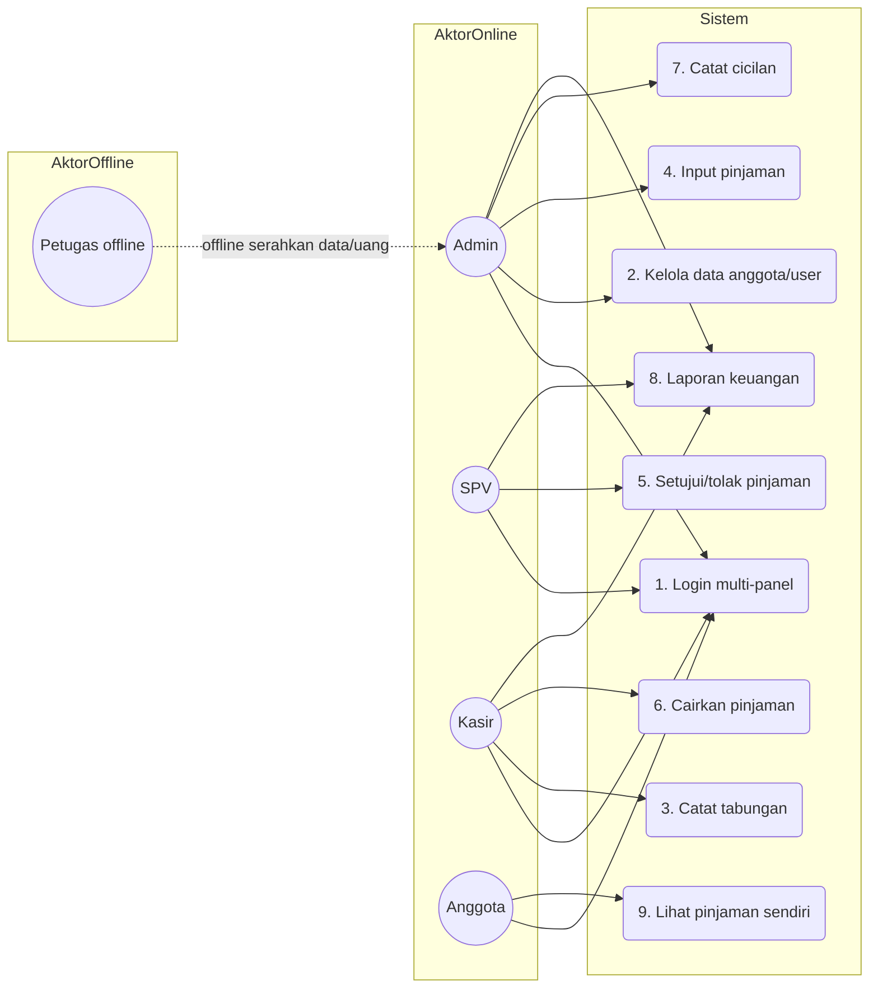
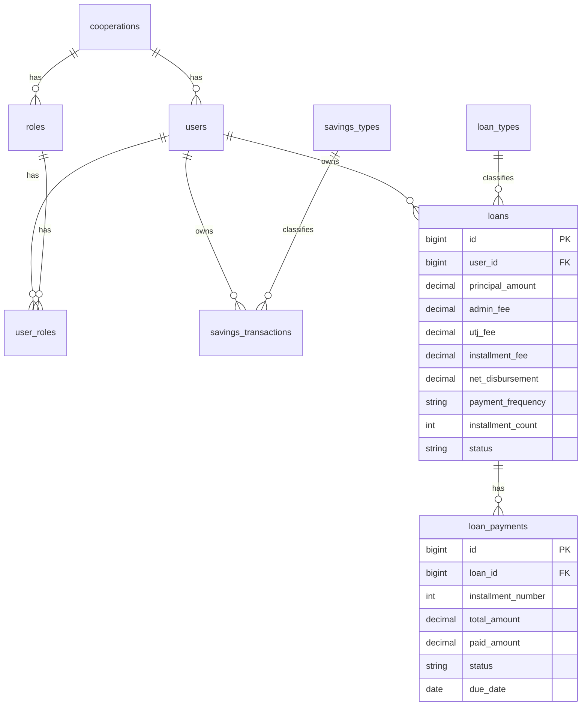
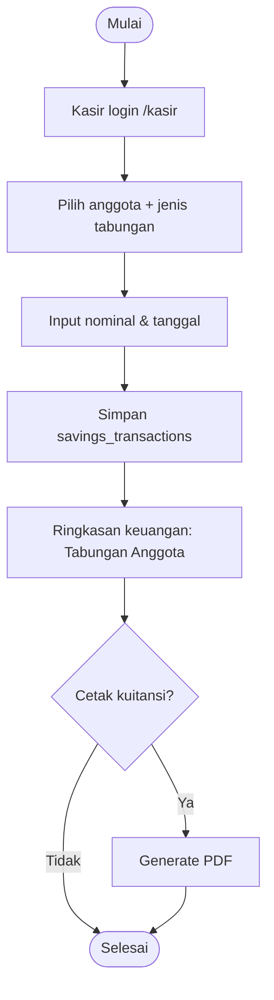
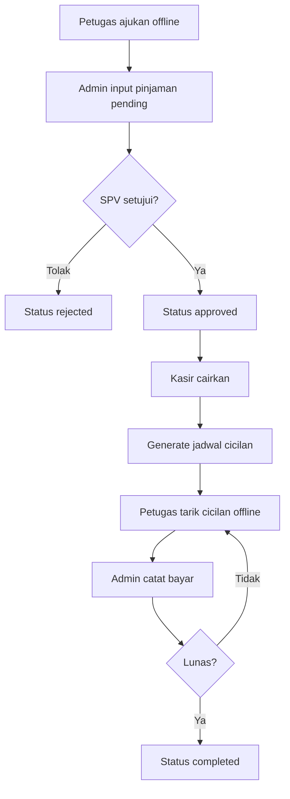
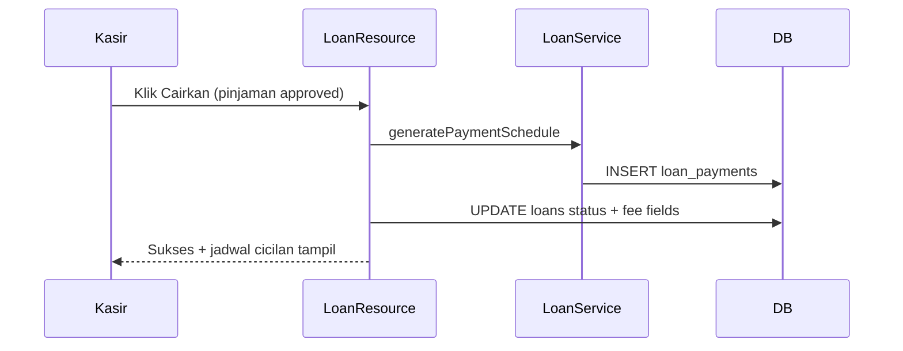

# BAB 4 HASIL DAN PEMBAHASAN

Bab ini menyajikan hasil pengembangan sistem informasi koperasi simpan pinjam berbasis website pada mitra **Karya Tantri Abadi**. Penulisan mengikuti metode *Research and Development* (R&D) yang diadaptasi dari model Borg & Gall (Mufadhol dkk., 2017). Pembahasan difokuskan pada analisis kebutuhan, perancangan, implementasi, pengujian fungsional (*Black Box Testing*), serta evaluasi penerimaan pengguna (*User Acceptance Testing*).

**Catatan istilah.** Secara formal akademik, modul dana anggota disebut **simpanan**. Mitra menyebutnya **tabungan** karena menyerupai menabung. Sistem menampilkan label **Tabungan**, sementara domain kode tetap `savings`. Judul skripsi tetap memakai kerangka *simpan pinjam*.

---

## 4.1 Hasil Penelitian

Hasil penelitian diuraikan mengikuti 10 tahapan R&D pada subbab 4.1.1 sampai 4.1.10.

### 4.1.1 Research and Information Collection (Analisis Kebutuhan)

Studi literatur, wawancara, dan observasi pada Karya Tantri Abadi menunjukkan pengelolaan masih mengandalkan pencatatan manual/*spreadsheet* yang tidak terintegrasi. Temuan utama:

1. Risiko kesalahan pencatatan tabungan (simpanan) dan pinjaman tinggi.
2. Penyusunan laporan lambat karena data tersebar.
3. Transparansi data pinjaman bagi anggota rendah (harus menanyakan pengelola).
4. Alur lapangan (petugas mencari nasabah dan menarik cicilan) berjalan offline dan belum tercatat rapi di sistem.

#### a. Aktor sistem

| Aktor | Status | Peran |
| :--- | :--- | :--- |
| Admin | user sistem | input pinjaman, catat cicilan, kelola data, pantau tabungan & laporan |
| SPV | user sistem | setujui/tolak pinjaman, pantau laporan |
| Kasir | user sistem | cairkan pinjaman, catat tabungan, lihat cicilan, laporan |
| Anggota | user sistem | lihat pinjaman kelompok (read-only); akun dipegang **ketua kelompok** |
| Petugas lapangan | **offline** | cari/dampingi nasabah, ajukan offline, kumpulkan cicilan; **tidak login** |

**Anggota** = nasabah yang sudah terdaftar di koperasi/sistem.  
**Nasabah** = sebutan lapangan sebelum/saat dilayani petugas.  
**Pemegang akun anggota** = **ketua kelompok** (wakil/penanggung jawab); 1 pinjaman → 1 `user_id` ketua; anggota biasa kelompok tidak wajib punya akun.

#### b. Use Case Diagram (ringkas)

### 4.1.2 Planning (Perencanaan Sistem)

Stack teknologi yang ditetapkan:

1. Backend: PHP 8.2+ / Laravel
2. UI multi-panel: Filament v3 (Livewire, Alpine.js, Tailwind)
3. Database: MySQL
4. Pustaka: DomPDF, Maatwebsite Excel, Spatie Backup

Arsitektur multi-panel:

| Panel | Path | Role |
| :--- | :--- | :--- |
| Login | `/auth/login` | semua |
| Admin | `/admin` | admin |
| Kasir | `/kasir` | kasir |
| SPV | `/spv` | spv |
| Anggota | `/anggota` | anggota |

Batasan perencanaan (sesuai mitra):

1. Scope = simpan pinjam (anggota, tabungan, pinjaman, angsuran, laporan).
2. POS/SHU tidak diaktifkan.
3. Petugas tidak diberi akun sistem.

### 4.1.3 Develop Preliminary Form of Product (Desain & Implementasi)

#### a. ERD inti

#### b. Parameter pinjaman kelompok

| Item | Nilai |
| :--- | :--- |
| Jenis | Kelompok |
| Plafon max | Rp 5.000.000 |
| Tenor max | 3 bulan |
| Frekuensi | mingguan / bulanan |
| Biaya angsuran | 11% dari nominal (fee dilunasi; bukan potongan cair) |
| Admin fee | 5% (potong di awal) |
| UTJ (tier) | ≤ Rp2.500.000 → 22%; ≥ Rp2.600.000 → 11% |
| Cair bersih | ≤ Rp2.500.000 → 73%; ≥ Rp2.600.000 → 84% (= nominal − admin − UTJ) |
| Total dilunasi | nominal + 11% |
| Cicilan weekly | tenor × 4 |

Implementasi: `App\Services\LoanCalculator` (threshold tier UTJ = Rp2.500.000) dan `LoanService::generatePaymentSchedule` (dijalankan saat pencairan).  
Contoh: nominal Rp1.000.000, tenor 3 bulan weekly → UTJ 22%, cair bersih Rp730.000, total dilunasi Rp1.110.000, 12 cicilan.  
Contoh tier tinggi: nominal Rp2.600.000 → UTJ 11%, cair bersih Rp2.184.000.

#### c. Alur tabungan

#### d. Alur pinjaman & cicilan

#### e. Sequence pencairan

#### f. Hak akses per role

| Role | Panel | Aksi utama |
| :--- | :--- | :--- |
| Admin | `/admin` | create/edit pinjaman pending, catat cicilan, kelola user/anggota, pantau tabungan, laporan, backup |
| SPV | `/spv` | setujui/tolak, lihat laporan |
| Kasir | `/kasir` | cairkan pinjaman, catat tabungan, lihat cicilan, laporan |
| Anggota | `/anggota` | lihat pinjaman sendiri (`user_id` auth) |
| Petugas | — | offline only |

Modul nonaktif di UI: POS/inventaris, SHU, manajemen jenis pinjaman, Role/Permission UI.

### 4.1.4 Preliminary Field Testing (Uji Coba Lapangan Awal)

Uji skala terbatas (Siklus 1) melibatkan pengembang dan 1–2 perwakilan pengelola (admin/kasir). Fokus: stabilitas dasar.

| Area | Hasil observasi |
| :--- | :--- |
| Login multi-panel | Redirect role ke panel benar (admin/spv/kasir/anggota) |
| Input tabungan | Transaksi tersimpan; validasi nominal 0/negatif menolak input |
| Input pinjaman pending | Fee tier terhitung otomatis (≤2,5jt: UTJ 22%/cair 73%; ≥2,6jt: UTJ 11%/cair 84%) |
| Akses silang panel | Anggota tidak dapat mengakses `/admin` |

Temuan awal: label UI masih campur “Simpanan/Tabungan”; sisa redirect legacy `/petugas`; modul POS/SHU masih muncul di sebagian draft navigasi.

### 4.1.5 Main Product Revision (Revisi Produk Utama)

Perbaikan berdasarkan uji awal:

1. Seragamkan label UI **Tabungan**.
2. Hapus redirect/akses panel petugas; petugas dikunci offline.
3. Nonaktifkan POS/SHU di panel aktif.
4. Rapikan validasi form dan pesan error.
5. Perjelas alur role admin–SPV–kasir–anggota.

### 4.1.6 Main Field Testing (Uji Coba Lapangan Utama)

Uji skala menengah (Siklus 2) melibatkan admin, SPV, kasir, dan beberapa anggota. Fokus: integritas alur bisnis end-to-end.

| Skenario | Hasil yang diamati |
| :--- | :--- |
| Admin input pinjaman pending | Status `pending`, fee tampil |
| SPV setujui/tolak | Status `approved` / `rejected` |
| Kasir cairkan | Status `disbursed`/`active`, jadwal cicilan digenerate |
| Admin catat cicilan | Status cicilan `paid`/`partial`, sisa hutang berkurang |
| Kasir coba catat cicilan | Tombol Catat Bayar tidak tersedia |
| Anggota lihat pinjaman | Hanya data miliknya; cair bersih & sisa terlihat |
| Laporan tabungan/pinjaman/keuangan | Data muncul sesuai filter |

### 4.1.7 Operational Product Revision (Revisi Produk Operasional)

Perbaikan lanjutan:

1. Catat cicilan **admin-only**.
2. Filter pinjaman anggota: `user_id = auth id`.
3. Hak akses tabungan: kasir + admin; anggota tidak kelola.
4. Role legacy (`petugas`, `bendahara`, `kepalayayasan`) dinonaktifkan di seeder.
5. Dokumentasi sistem/UAT diselaraskan ke code final.

### 4.1.8 Operational Field Testing (Uji Operasional + UAT)

Uji skala operasional (Siklus 3) diarahkan pada pengguna sistem aktif: **Admin, SPV, Kasir, Anggota**. Petugas diuji sebagai aktor offline (menyerahkan data/uang ke admin).

#### a. Ringkasan Black Box Testing

Teknik: Equivalence Class Partitioning (ECP), Boundary Value Analysis (BVA), Error Guessing. Skenario lengkap ada di `BLACK_BOX_UAT_TESTING.md` dan form peneliti `CHECKLIST_DEMO_BLACKBOX.docx`.

Pengujian fungsional dijalankan ulang pada basis data bersih (`migrate:fresh` + seed) melalui probe sistem `scripts/blackbox_probe.php` (tanggal 22 Juli 2026). Rekap hasil:

| Modul | Jumlah kasus | Lulus (L) | Tidak lulus (TL) | % Lulus |
| :--- | ---: | ---: | ---: | ---: |
| Login & multi-panel | 9 | 9 | 0 | 100% |
| Tabungan | 6 | 6 | 0 | 100% |
| Pinjaman kelompok (+fee tier) | 16 | 16 | 0 | 100% |
| Laporan & scope | 5 | 5 | 0 | 100% |
| **TOTAL** | **36** | **36** | **0** | **100%** |

Contoh hasil verifikasi fungsional:

| ID | Fitur | Hasil |
| :--- | :--- | :--- |
| login-01..04 | Login per role | Redirect ke panel sesuai role |
| login-08 / login-captcha | Akses silang & CAPTCHA | Akses silang ditolak; login email+password only |
| tb-01/tb-02 | Tabungan nominal valid/invalid | Valid disimpan; invalid ditolak |
| ln-01 | Input pinjaman 1jt, 3 bln weekly | UTJ 22%; cair Rp730.000; total Rp1.110.000; 12 cicilan |
| ln-01b | Input pinjaman 2,6jt (tier tinggi) | UTJ 11%; cair Rp2.184.000 |
| ln-01c | Input pinjaman 2,5jt (batas tier rendah) | UTJ 22%; cair Rp1.825.000 |
| ln-02/ln-03 | Plafon/tenor di atas batas | Divalidasi/ditolak |
| ln-04..08 | Approve SPV + cair kasir + catat cicilan | Status, 12 baris jadwal, bayar 1 cicilan OK |
| ln-09/ln-10 | Wewenang cicilan & anggota | Admin catat; anggota hanya pinjaman sendiri |
| sc-01/sc-02 | POS/SHU & petugas login | Tidak tersedia; `/petugas` 404 |
| seed-tier-high/low | Seed PinjamanSeeder | 5jt → cair 4.200.000; 1jt → cair 730.000 |

Bukti angka disimpan di `HASIL_BLACKBOX_SESI.md` / `.docx` dan `storage/app/blackbox_probe_latest.json`. Bukti UI fee tier ada di `bukti-blackbox/19-fee-tier-1jt-cair-730rb.png`, `20-fee-tier-26jt-cair-2184jt.png`, dan `21-daftar-pinjaman-fee-tier.png`.

> Catatan: 100% lulus pada probe fungsional internal/demo **bukan** skor UAT lapangan mitra.

#### b. Instrumen UAT

Skala Likert 1–4 (SS=4, S=3, TS=2, STS=1). Sepuluh pernyataan:

1. Aplikasi mempermudah pencatatan tabungan dan pinjaman.
2. Alur pinjaman admin → SPV → kasir sesuai kebutuhan.
3. Pencatatan cicilan oleh admin memudahkan rekap setoran petugas.
4. Ketua kelompok (akun anggota) dapat memantau pinjaman kelompok dengan jelas.
5. Menu dan tombol mudah dipahami.
6. Proses login berjalan lancar dan aman.
7. Akses/unduh laporan mudah dilakukan.
8. Tampilan antarmuka nyaman digunakan.
9. Aplikasi stabil selama uji coba.
10. Secara keseluruhan saya puas dengan sistem.

Rumus kelayakan:

$$\text{Persentase Kelayakan (\%)} = \frac{\text{Total Skor Aktual}}{\text{Total Skor Maksimum}} \times 100\%$$

Total skor maksimum = jumlah responden × 10 × 4.

> **Status data UAT lapangan:** angka distribusi skor dan persentase kelayakan final diisi setelah uji lapangan riil mitra. Template form & berita acara tersedia di `PANDUAN_DAN_FORM_PENGUJIAN.md`.

### 4.1.9 Final Product Revision (Revisi Produk Akhir)

Penyesuaian akhir sebelum serah terima:

1. Label UI Tabungan diseragamkan.
2. Petugas offline dikunci (tanpa panel/login).
3. Role aktif hanya admin, SPV, kasir, anggota.
4. Scope POS/SHU tetap nonaktif.
5. Fee pinjaman disesuaikan tabel mitra (UTJ 22%/11%, cair 73%/84%).
6. Seed demo, probe black box, dan dokumentasi diselaraskan dengan code.

### 4.1.10 Dissemination and Implementation

Sistem diarahkan untuk operasional simpan pinjam mitra Karya Tantri Abadi. Diseminasi mencakup:

1. Manual book / panduan singkat per role.
2. Akun demo seed (`*@karya-tantri-abadi.test` / `password`).
3. Pelatihan alur: input pinjaman, approve, cair, catat cicilan, tabungan, laporan.
4. Repository implementasi: `karya_tantri_abadi` (GitHub).

---

## 4.2 Pembahasan

### 4.2.1 Menjawab rumusan masalah pertama (proses perancangan & pengembangan)

Proses pengembangan mengikuti metode R&D 10 tahap dengan tiga siklus uji–revisi. Analisis kebutuhan memetakan aktor online (admin, SPV, kasir, anggota) dan aktor offline (petugas). Perancangan menghasilkan multi-panel Filament, ERD simpan pinjam, serta layanan kalkulasi pinjaman kelompok. Implementasi menanamkan alur:

**petugas offline → admin input → SPV setujui → kasir cairkan → admin catat cicilan → anggota lihat.**

Dengan demikian, perancangan dan pembangunan sistem tidak hanya menghasilkan fitur teknis, tetapi juga menyesuaikan wewenang operasional mitra.

### 4.2.2 Menjawab rumusan masalah kedua (evaluasi efisiensi, transparansi, akuntabilitas)

Evaluasi dilakukan melalui Black Box (fungsional) dan instrumen UAT (penerimaan pengguna). Dari sisi fungsional, setelah reset basis data dan seed ulang, 36 kasus verifikasi lulus 100%: fee berjenjang otomatis (contoh Rp1.000.000 → cair Rp730.000; Rp2.600.000 → cair Rp2.184.000), jadwal cicilan saat pencairan, pembatasan aksi per role, dan isolasi data anggota.

| Parameter | Sebelum | Sesudah |
| :--- | :--- | :--- |
| Pencatatan tabungan | Manual/spreadsheet | Input sistem (kasir), laporan terpusat |
| Persetujuan pinjaman | Lisan/tidak terstruktur | Workflow admin → SPV → kasir |
| Cicilan | Buku lapangan terpisah | Admin catat di jadwal digital |
| Transparansi anggota | Tanya pengelola | Panel anggota menampilkan pinjaman sendiri |
| Laporan | Rekap manual | Laporan pinjaman/tabungan/keuangan di panel |

Transparansi meningkat karena anggota dapat melihat cair bersih, angsuran, dan sisa hutang. Akuntabilitas meningkat karena status pinjaman berjenjang, pencatatan cicilan memuat jejak admin, dan log aktivitas tersedia di panel admin.

### 4.2.3 Kesesuaian metode R&D

Metode R&D cocok karena kebutuhan mitra bersifat dinamis: istilah tabungan vs simpanan, pemisahan wewenang SPV/kasir, dan keputusan petugas tetap offline muncul selama iterasi. Siklus uji berjenjang mengurangi risiko mengoperasikan sistem keuangan sebelum alur stabil. Berbeda dengan *Waterfall* yang kaku dan *Agile* yang menekankan kecepatan rilis, R&D menekankan validasi lapangan dan revisi terdokumentasi.

### 4.2.4 Pemetaan istilah dan batasan

1. **Simpanan (formal)** = **Tabungan (mitra/UI)**. Tidak mengubah judul skripsi.
2. Petugas mencari nasabah adalah proses bisnis offline, bukan fitur marketing/CRM di website.
3. POS dan SHU tidak dibahas sebagai fitur aktif agar selaras batasan masalah simpan pinjam.

### 4.2.5 Keterbatasan

1. Angka UAT lapangan final menunggu pelaksanaan kuesioner mitra.
2. Sebagian test otomatis legacy masih memakai asumsi bunga lama/POS; perlu penyesuaian terpisah.
3. Petugas belum memiliki rekap digital khusus; rekap dapat diberikan manual/WA dari admin/kasir bila dibutuhkan.
4. Diagram pada naskah proposal masih dapat dilengkapi aset gambar UI hasil tangkapan layar sistem.

---

## 4.3 Ringkasan Hasil

1. Sistem multi-panel Karya Tantri Abadi berhasil diimplementasikan untuk simpan pinjam.
2. Alur pinjaman kelompok dan fee tier (angsuran 11%, admin 5%, UTJ 22%/11%, cair 73%/84%) tertanam di layanan kalkulasi.
3. Tabungan tercatat di sistem dengan label mitra, tanpa mengubah kerangka formal simpan pinjam.
4. Petugas tetap offline; pengguna sistem = admin, SPV, kasir, anggota.
5. Black Box: 36 kasus verifikasi lulus 100% (termasuk fee tier); UAT disiapkan Likert 1–4 (data lapangan menyusul).
6. Tiga siklus revisi R&D menghasilkan sistem yang selaras aturan bisnis mitra dan batasan penelitian.

---

## 4.4 Lampiran Ringkas Bahan Uji

| Dokumen | Isi |
| :--- | :--- |
| `BLACK_BOX_UAT_TESTING.md` | Skenario black box + kuesioner UAT |
| `HASIL_BLACKBOX_SESI.md` / `.docx` | Rekap hasil black box sesi reset DB (36/36 L) |
| `CHECKLIST_DEMO_BLACKBOX.docx` | Form demo + checklist (diisi peneliti) |
| `bukti-blackbox/` | Screenshot UI (login, panel, fee tier) |
| `PANDUAN_DAN_FORM_PENGUJIAN.md` | Walkthrough demo + form UAT + berita acara |
| `DESKRIPSI_WEBSITE.md` | Deskripsi arsitektur & fitur sistem |
| `ACTIVITY_DIAGRAM.md` | Diagram alur tabungan, pinjaman, cicilan, login |

Akun demo seed:

| Email | Role | Password |
| :--- | :--- | :--- |
| `admin@karya-tantri-abadi.test` | admin | `password` |
| `spv@karya-tantri-abadi.test` | spv | `password` |
| `kasir@karya-tantri-abadi.test` | kasir | `password` |
| `anggota@karya-tantri-abadi.test` | anggota | `password` |
