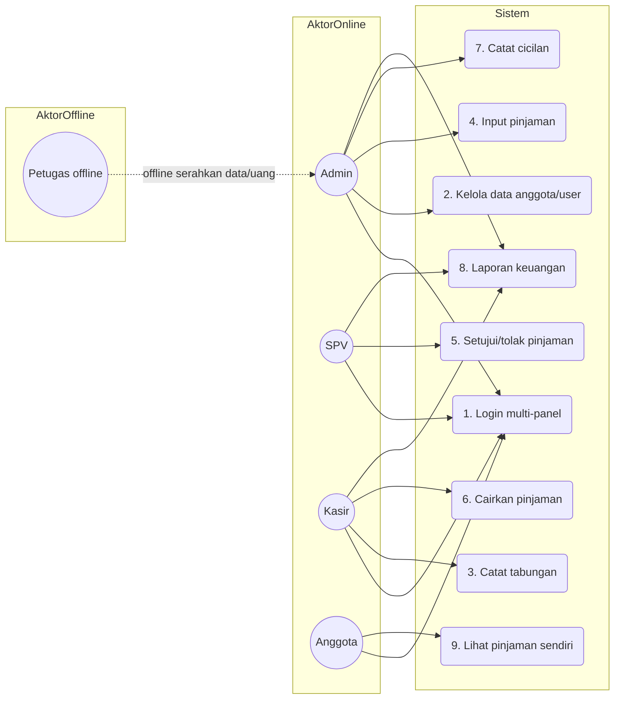
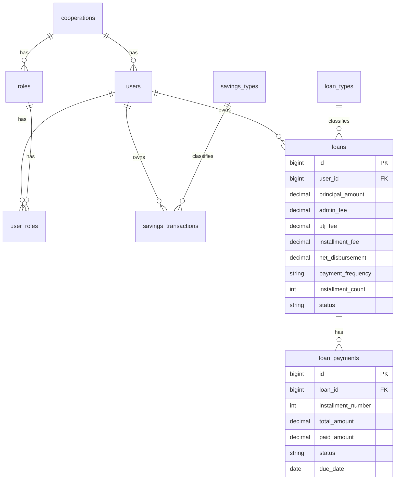
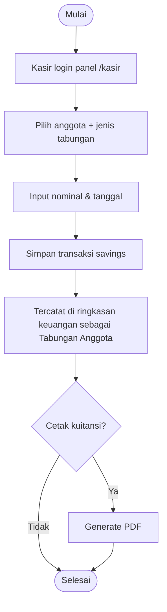
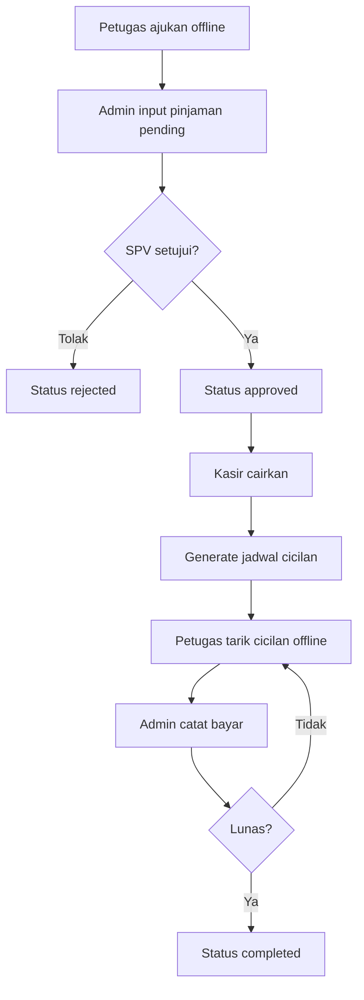
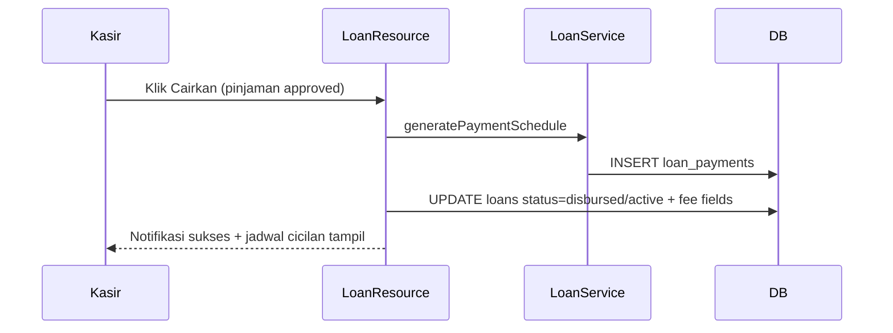

# BAB IV: HASIL DAN PEMBAHASAN

Bab ini menyajikan hasil pengembangan sistem informasi koperasi simpan pinjam berbasis website pada mitra **Karya Tantri Abadi**. Penulisan mengikuti metode *Research and Development* (R&D) yang diadaptasi dari model Borg & Gall (Mufadhol dkk., 2017). Fokus pembahasan adalah analisis kebutuhan, perancangan, implementasi, pengujian fungsional (*Black Box Testing*), dan evaluasi penerimaan pengguna (*User Acceptance Testing*).

> **Catatan istilah:** Secara formal akademik, modul dana anggota disebut **simpanan**. Mitra menyebutnya **tabungan** karena menyerupai menabung. Sistem menampilkan label **Tabungan**, sementara domain kode tetap `savings`. Judul skripsi tetap memakai *simpan pinjam*.

---

## A. HASIL PENELITIAN

### 1. Research and Information Collection (Analisis Kebutuhan)

Studi literatur, wawancara, dan observasi pada Karya Tantri Abadi menunjukkan pengelolaan masih mengandalkan pencatatan manual/*spreadsheet* yang tidak terintegrasi. Dampaknya:

* risiko kesalahan pencatatan tabungan (simpanan) dan pinjaman tinggi
* penyusunan laporan lambat
* transparansi data pinjaman bagi anggota rendah
* alur lapangan (petugas mencari nasabah dan menarik cicilan) belum tercatat rapi di sistem

#### Aktor sistem

| Aktor | Status | Peran |
| :--- | :--- | :--- |
| Admin | user sistem | input pinjaman, catat cicilan, kelola data, pantau tabungan & laporan |
| SPV | user sistem | setujui/tolak pinjaman |
| Kasir | user sistem | cairkan pinjaman, catat tabungan, laporan |
| Anggota | user sistem | lihat pinjaman sendiri (read-only) |
| Petugas lapangan | **offline** | cari/dampingi nasabah, ajukan offline, kumpulkan cicilan; **tidak login** |

Anggota = nasabah yang sudah terdaftar di koperasi/sistem.

#### Use Case Diagram (ringkas)

### 2. Planning (Perencanaan Sistem)

Stack teknologi:

* PHP 8.2+ / Laravel
* Filament v3 (Livewire, Alpine.js, Tailwind)
* MySQL
* DomPDF, Maatwebsite Excel, Spatie Backup, reCAPTCHA

Arsitektur **multi-panel**:

1. `/admin` — Admin
2. `/kasir` — Kasir
3. `/spv` — SPV
4. `/anggota` — Anggota
5. `/auth/login` — gerbang login

Batasan perencanaan (sesuai mitra):

* scope = simpan pinjam (anggota, tabungan, pinjaman, angsuran, laporan)
* POS/SHU tidak diaktifkan
* petugas tidak diberi akun sistem

### 3. Develop Preliminary Product (Desain & Implementasi)

#### A. ERD inti (simpan pinjam)

#### B. Parameter pinjaman kelompok

| Item | Nilai |
| :--- | :--- |
| Jenis | Kelompok |
| Plafon max | Rp 5.000.000 |
| Tenor max | 3 bulan |
| Frekuensi | mingguan / bulanan |
| Biaya angsuran | 11% |
| Admin | 5% |
| UTJ | 22% |
| Cair bersih | 73% |
| Total dilunasi | nominal + 11% |

Implementasi: `App\Services\LoanCalculator` dan `LoanService::generatePaymentSchedule` (dijalankan saat pencairan).

#### C. Activity: Tabungan

#### D. Activity: Pinjaman & cicilan

#### E. Sequence ringkas: pencairan

#### F. Implementasi panel & hak akses

| Role | Panel | Aksi utama |
| :--- | :--- | :--- |
| Admin | `/admin` | create/edit pinjaman pending, catat cicilan, kelola user/anggota, pantau tabungan, laporan, backup |
| SPV | `/spv` | setujui/tolak, lihat laporan |
| Kasir | `/kasir` | cairkan pinjaman, catat tabungan, lihat cicilan, laporan |
| Anggota | `/anggota` | lihat pinjaman sendiri (filter `user_id`) |
| Petugas | — | offline only |

Modul nonaktif di UI: POS/inventaris, SHU, LoanType management, Role/Permission UI.

### 4–7. Siklus uji lapangan awal s.d. revisi operasional

Pengujian dilakukan bertahap (R&D):

1. **Preliminary field testing** — developer + 1 pengelola: login multi-panel, input tabungan, input pinjaman pending.
2. **Main product revision** — perbaikan validasi, redirect role, label Tabungan, nonaktif POS/SHU.
3. **Main field testing** — admin, SPV, kasir, beberapa anggota: alur approve–cair–cicilan–laporan.
4. **Operational product revision** — penyesuaian wewenang cicilan (admin-only), anggota hanya data sendiri, petugas offline dikunci.

### 8. Operational Field Testing (UAT)

UAT diarahkan pada pengguna sistem aktif: **Admin, SPV, Kasir, Anggota** (bukan bendahara/kepala yayasan/POS).

Contoh instrumen pernyataan (Likert 1–4):

1. Aplikasi mempermudah pencatatan tabungan dan pinjaman.
2. Alur pinjaman admin → SPV → kasir mudah dipahami.
3. Pencatatan cicilan oleh admin sesuai praktik penyerahan uang dari petugas.
4. Anggota dapat melihat sisa pinjaman/cair bersih dengan jelas.
5. Menu dan navigasi mudah digunakan.
6. Login berjalan lancar dan aman.
7. Laporan keuangan/pinjaman/tabungan mudah diakses.
8. Tampilan antarmuka nyaman digunakan.
9. Aplikasi stabil selama uji coba.
10. Secara keseluruhan saya puas dengan sistem.

Rumus kelayakan:

$$\text{Persentase Kelayakan (\%)} = \frac{\text{Total Skor Aktual}}{\text{Total Skor Maksimum}} \times 100\%$$

> Hasil numerik UAT diisi setelah uji lapangan riil mitra. Template form fisik ada di `PANDUAN_DAN_FORM_PENGUJIAN.md`.

### 9. Final Product Revision

Penyesuaian akhir sebelum serah terima:

* label UI Tabungan diseragamkan
* petugas offline dikunci (tanpa panel)
* role aktif hanya admin/spv/kasir/anggota
* scope POS/SHU tetap nonaktif
* seed demo dan dokumentasi diselaraskan

### 10. Dissemination and Implementation

Sistem dijalankan di lingkungan mitra Karya Tantri Abadi untuk operasional simpan pinjam. Diseminasi mencakup manual book, akun demo, dan pelatihan singkat alur role.

---

## B. PEMBAHASAN

### 1. Kesesuaian metode R&D

Pendekatan R&D cocok karena kebutuhan mitra bersifat dinamis: istilah tabungan vs simpanan, pemisahan wewenang SPV/kasir, dan keputusan petugas tetap offline muncul selama iterasi. Siklus uji berjenjang mengurangi risiko mengoperasikan sistem keuangan sebelum alur stabil.

### 2. Efisiensi operasional

| Parameter | Sebelum | Sesudah |
| :--- | :--- | :--- |
| Pencatatan tabungan | Manual/spreadsheet | Input sistem (kasir), saldo & laporan terpusat |
| Persetujuan pinjaman | Lisan/tidak terstruktur | Status workflow admin → SPV → kasir |
| Cicilan | Buku lapangan terpisah | Admin catat di jadwal cicilan digital |
| Transparansi anggota | Tanya pengelola | Panel anggota menampilkan pinjaman sendiri |
| Laporan | Rekap manual | Laporan pinjaman/tabungan/keuangan di panel |

### 3. Transparansi dan akuntabilitas

* Anggota melihat cair bersih, angsuran, dan sisa hutang miliknya.
* Admin/SPV/kasir memiliki jejak status pinjaman yang jelas.
* Catatan cicilan memuat siapa yang mencatat; uang dari petugas diserahkan dulu ke admin (sesuai modal deskripsi sistem).
* Audit log tersedia di admin untuk jejak aktivitas penting.

### 4. Pemetaan istilah dan batasan

* **Simpanan (formal)** = **Tabungan (mitra/UI)**. Tidak mengubah judul skripsi.
* Petugas mencari nasabah adalah proses bisnis offline, bukan fitur marketing di website.
* POS dan SHU tidak dibahas sebagai fitur aktif agar selaras batasan masalah simpan pinjam.

### 5. Keterbatasan

* UAT kuantitatif final bergantung pelaksanaan lapangan mitra.
* Beberapa test otomatis legacy masih memakai asumsi bunga lama/POS; perlu penyesuaian terpisah.
* Petugas belum memiliki rekap digital khusus; rekap dapat diberikan manual/WA dari admin/kasir bila dibutuhkan.

---

## C. RINGKASAN HASIL

1. Sistem multi-panel Karya Tantri Abadi berhasil diimplementasikan untuk simpan pinjam.
2. Alur pinjaman kelompok dan fee (11/5/22, cair 73%) tertanam di layanan kalkulasi.
3. Tabungan tercatat di sistem dengan label mitra, tanpa mengubah kerangka formal simpan pinjam.
4. Petugas tetap offline; pengguna sistem = admin, SPV, kasir, anggota.
5. Dokumen pengujian dan UAT diselaraskan ke role/alur baru (tanpa POS/SHU sebagai fokus).
