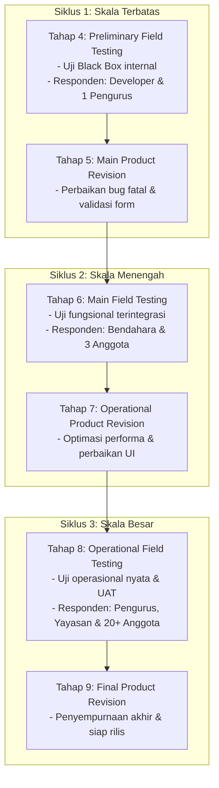

# Dokumen Pengujian: Black Box Testing & User Acceptance Testing (UAT)

Dokumen ini berisi rancangan skenario pengujian fungsional menggunakan metode **Black Box Testing** dan pengujian penerimaan pengguna menggunakan metode **User Acceptance Testing (UAT)** untuk aplikasi **Karya Tantri Abadi**.

---

## Pemetaan Siklus Pengujian & Revisi (Metode R&D)
Sesuai dengan metode **Research and Development (R&D)** yang bersifat eksploratif dan iteratif, pengujian dan revisi pada sistem ini **tidak dilakukan hanya sekali**, melainkan melalui 3 siklus terpisah yang saling berkesinambungan:

### Detail Siklus Pengujian & Revisi:

1.  **Siklus 1: Pengujian Awal (Tahap 4) & Revisi Utama (Tahap 5)**
    *   **Responden:** Developer internal & 1 orang Bendahara.
    *   **Fokus Uji:** Menguji kestabilan fungsional dasar (form login, input simpanan dasar, pengajuan pinjaman).
    *   **Tujuan:** Mendeteksi dan mengeliminasi bug fatal (*system crash* atau kegagalan query database).
    *   **Hasil Revisi:** Perbaikan logika validasi input, perbaikan konfigurasi CAPTCHA, dan penanganan eror (*exception handling*).

2.  **Siklus 2: Pengujian Lapangan Utama (Tahap 6) & Revisi Operasional (Tahap 7)**
    *   **Responden:** Bendahara, 3 perwakilan Anggota, dan 1 perwakilan Yayasan.
    *   **Fokus Uji:** Menguji alur data terintegrasi (transaksi POS kasir memotong stok dan mencatat kas masuk, perhitungan jadwal angsuran cicilan pinjaman, ekspor PDF kuitansi).
    *   **Tujuan:** Memastikan integritas data (*data integrity*) antar modul berjalan sinkron dan tidak ada kegagalan alur bisnis.
    *   **Hasil Revisi:** Optimasi render PDF DomPDF agar lebih cepat, perbaikan tata letak UI Filament yang kurang responsif pada perangkat tablet, dan perbaikan relasi database minor.

3.  **Siklus 3: Pengujian Lapangan Operasional (Tahap 8) & Revisi Akhir (Tahap 9)**
    *   **Responden:** Pengurus Koperasi, Kepala Yayasan, dan 20+ Anggota Koperasi aktif.
    *   **Fokus Uji:** Keandalan operasional dalam kondisi riil di koperasi, serta penilaian subjektif pengguna menggunakan kuesioner **User Acceptance Testing (UAT)**.
    *   **Tujuan:** Memperoleh data empiris tingkat penerimaan sistem (TAM/UTAUT) untuk kebutuhan data ilmiah skripsi.
    *   **Hasil Revisi:** Pembersihan data uji fiktif, finalisasi konfigurasi *backup database* terjadwal, dan penyesuaian teks/label kecil sesuai preferensi bahasa pengguna koperasi.

---

## Bagian 1: Black Box Testing
Pengujian ini berfokus pada fungsionalitas sistem (input-output) tanpa melihat struktur internal kode. Teknik yang digunakan adalah **Equivalence Class Partitioning (ECP)** untuk rentang data valid/invalid, **Boundary Value Analysis (BVA)** untuk pengujian nilai batas, dan **Error Guessing** untuk skenario kesalahan manual.

### 1.1 Skenario Pengujian: Autentikasi & Login (Multi-panel)
*   **Tujuan:** Memastikan pengguna dapat login ke panel yang sesuai (Admin, Bendahara, Anggota, Kepala Yayasan) berdasarkan hak akses dengan validasi reCAPTCHA.

| ID Uji | Fitur | Input | Hasil yang Diharapkan | Metode | Status |
| :--- | :--- | :--- | :--- | :--- | :--- |
| login-01 | Form Login | Email, Password, reCAPTCHA Valid | Sistem memvalidasi, mengarahkan pengguna ke panel sesuai perannya. | ECP | Berhasil |
| login-02 | Form Login | Email Kosong / Password Kosong | Tampil pesan peringatan "The email field is required" atau "The password field is required". | BVA | Berhasil |
| login-03 | Form Login | Email salah format (tanpa @) | Tampil pesan error format email tidak valid. | ECP | Berhasil |
| login-04 | Form Login | Email/Password salah | Tampil pesan "These credentials do not match our records". | ECP | Berhasil |
| login-05 | Form Login | CAPTCHA belum dicentang/salah | Tampil pesan error validasi reCAPTCHA gagal. | Error Guessing | Berhasil |

---

### 1.2 Skenario Pengujian: Modul Simpanan (Savings)
*   **Tujuan:** Memvalidasi pencatatan setoran, penarikan, pembaruan saldo anggota, dan integrasi kas masuk/keluar.

| ID Uji | Fitur | Input | Hasil yang Diharapkan | Metode | Status |
| :--- | :--- | :--- | :--- | :--- | :--- |
| sv-01 | Setoran Simpanan | Nominal Setoran = Rp0 atau Negatif | Sistem menolak input, tampil pesan error "Nominal harus lebih dari 0". | BVA | Berhasil |
| sv-02 | Setoran Simpanan | Nominal Valid (misal: Rp50.000) | Transaksi disimpan, saldo bertambah, tercatat jurnal kas masuk (Debit) di cash flow. | ECP | Berhasil |
| sv-03 | Penarikan Simpanan | Nominal Tarik > Saldo Sukarela Anggota | Sistem menolak transaksi, tampil pesan error "Saldo tidak mencukupi". | BVA | Berhasil |
| sv-04 | Penarikan Simpanan | Nominal Tarik <= Saldo Sukarela | Transaksi disimpan, saldo berkurang, tercatat kas keluar (Kredit) di cash flow. | ECP | Berhasil |
| sv-05 | Cetak Kuitansi | Tombol Cetak diklik | Sistem merender dokumen PDF kuitansi transaksi simpanan secara presisi. | ECP | Berhasil |

---

### 1.3 Skenario Pengujian: Modul Pinjaman (Loans)
*   **Tujuan:** Menguji pengajuan pinjaman, limit plafon, tenor bunga, pencairan, dan pembayaran angsuran bulanan.

| ID Uji | Fitur | Input | Hasil yang Diharapkan | Metode | Status |
| :--- | :--- | :--- | :--- | :--- | :--- |
| ln-01 | Pengajuan Pinjaman | Anggota mengajukan pinjaman dengan tenor melebihi batas tipe pinjaman | Pengajuan ditolak oleh validasi sistem dengan pesan batas maksimum tenor. | BVA | Berhasil |
| ln-02 | Persetujuan & Cair | Status diubah menjadi "Disetujui" & dicairkan | Sistem otomatis men-generate tabel jadwal angsuran bulanan sesuai tenor & mencatat pengeluaran kas. | ECP | Berhasil |
| ln-03 | Angsuran Pinjaman | Bayar cicilan nominal = angsuran bulanan | Status angsuran bulan terkait menjadi Lunas, sisa saldo utang pinjaman berkurang. | ECP | Berhasil |
| ln-04 | Angsuran Pinjaman | Bayar cicilan melebihi sisa utang pinjaman | Sistem menolak input atau menyesuaikan ke sisa kembalian utang riil. | BVA | Berhasil |

---

### 1.4 Skenario Pengujian: POS Toko Koperasi (Retail)
*   **Tujuan:** Memvalidasi kasir retail, pemotongan stok otomatis, pembayaran tunai/piutang anggota, dan stock movement log.

| ID Uji | Fitur | Input | Hasil yang Diharapkan | Metode | Status |
| :--- | :--- | :--- | :--- | :--- | :--- |
| pos-01 | Input Produk | Scan produk yang stoknya habis (Stok = 0) | Sistem menampilkan peringatan "Stok produk tidak mencukupi" dan mencegah checkout. | BVA | Berhasil |
| pos-02 | Pembayaran Tunai | Pilih metode Tunai, Nominal Bayar >= Total Belanja | Transaksi selesai, kembalian dihitung, stok terpotong, cash flow kas masuk tercatat. | ECP | Berhasil |
| pos-03 | Pembayaran Kredit | Pilih Kredit Anggota, Saldo/Limit Kredit Cukup | Transaksi selesai, saldo simpanan terpotong/utang bertambah, stok produk berkurang. | ECP | Berhasil |
| pos-04 | Pembayaran Kredit | Pilih Kredit Anggota, Saldo/Limit Kredit Kurang | Sistem memblokir pembayaran kredit dengan pesan "Limit kredit atau saldo anggota tidak cukup". | BVA | Berhasil |

---

### 1.5 Skenario Pengujian: Perhitungan Sisa Hasil Usaha (SHU)
*   **Tujuan:** Memastikan pembagian laba tahunan terhitung secara proporsional sesuai partisipasi simpanan dan belanja.

| ID Uji | Fitur | Input | Hasil yang Diharapkan | Metode | Status |
| :--- | :--- | :--- | :--- | :--- | :--- |
| shu-01 | Alokasi SHU | Persentase alokasi SHU disimpan | Sistem memvalidasi total persentase pembagian (cadangan, pengurus, dll) wajib 100%. | BVA | Berhasil |
| shu-02 | Hitung SHU Anggota | Inisiasi hitung otomatis akhir tahun | Sistem menghitung laba bersih, membagikan porsi anggota berdasarkan proporsi simpanan & belanja. | ECP | Berhasil |

---

## Bagian 2: User Acceptance Testing (UAT)
Pengujian penerimaan dilakukan oleh pengguna akhir untuk menilai kesesuaian sistem dengan kebutuhan nyata. Pengujian ini menggunakan instrumen kuesioner berskala Likert 1-4 untuk menghindari nilai tengah (netral).

### 2.1 Indikator Penilaian UAT (Variabel TAM/UTAUT)
Penilaian diklasifikasikan ke dalam 4 variabel utama:
1.  **Perceived Usefulness (Kemudahan & Kemanfaatan):** Sejauh mana aplikasi meningkatkan efisiensi kerja operasional koperasi.
2.  **Ease of Use (Kemudahan Penggunaan):** Kemudahan navigasi, pemahaman modul, dan kejelasan instruksi.
3.  **User Experience (Tampilan Antarmuka):** Keindahan visual, konsistensi warna, kejelasan font, dan responsivitas layout.
4.  **Satisfaction (Kepuasan Pengguna):** Kepuasan keseluruhan dalam menggunakan aplikasi untuk transaksi harian.

---

### 2.2 Kuesioner Evaluasi UAT
Pernyataan di bawah ini diberikan kepada responden (Pengurus/Bendahara, Anggota, Kepala Yayasan) dengan pilihan jawaban:
*   Skor 4: **Sangat Setuju (SS)**
*   Skor 3: **Setuju (S)**
*   Skor 2: **Tidak Setuju (TS)**
*   Skor 1: **Sangat Tidak Setuju (STS)**

| No | Pernyataan | Variabel | STS (1) | TS (2) | S (3) | SS (4) |
| :--- | :--- | :--- | :---: | :---: | :---: | :---: |
| 1 | Aplikasi ini mempermudah proses pencatatan simpanan dan pinjaman. | Usefulness | | | | |
| 2 | Sistem pencatatan kasir toko (POS) mempercepat transaksi belanja. | Usefulness | | | | |
| 3 | Perhitungan SHU anggota menjadi lebih cepat, akurat, dan transparan. | Usefulness | | | | |
| 4 | Menu dan tombol pada aplikasi mudah dipahami dan digunakan. | Ease of Use | | | | |
| 5 | Proses login dengan verifikasi reCAPTCHA berjalan lancar dan aman. | Ease of Use | | | | |
| 6 | Pengunduhan laporan keuangan (PDF/Excel) mudah dilakukan. | Ease of Use | | | | |
| 7 | Tampilan warna antarmuka aplikasi menarik dan nyaman di mata. | Experience | | | | |
| 8 | Informasi saldo dan transaksi dapat diakses secara cepat dan responsif. | Experience | | | | |
| 9 | Secara keseluruhan, aplikasi ini berjalan stabil dan bebas dari kendala fatal. | Satisfaction| | | | |
| 10| Saya merasa puas dengan kinerja sistem informasi koperasi ini. | Satisfaction| | | | |

---

### 2.3 Metode Pengolahan Data & Penentuan Nilai Validitas
Rumus akumulasi skor kelayakan sistem dihitung menggunakan rumus persentase berikut:

$$\text{Persentase Kelayakan (\%)} = \frac{\text{Total Skor Aktual}}{\text{Total Skor Maksimum}} \times 100\%$$

*   **Total Skor Aktual:** Jumlah skor dari seluruh jawaban responden.
*   **Total Skor Maksimum:** Jumlah responden $\times$ Jumlah pernyataan (10) $\times$ Skor tertinggi (4).

Berdasarkan klasifikasi validitas proposal skripsi (halaman 18), nilai akumulasi rata-rata per item pertanyaan dikelompokkan sebagai berikut:

*   **Skor Rata-rata ($n$):**

$$\text{Nilai Validitas } (n) = \frac{\text{Total Skor Aktual}}{\text{Jumlah Responden}}$$

#### Kriteria Interpretasi Skor Validitas ($n$):
*   $1 \le n < 10$: **Tidak Baik (Not Good)**
*   $11 \le n < 20$: **Cukup (Fair)**
*   $21 \le n < 30$: **Baik (Good)**
*   $31 \le n \le 40$: **Sangat Baik atau Valid (Very Good)**
