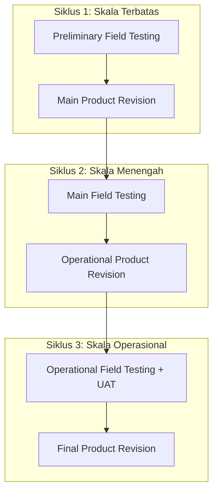

# Dokumen Pengujian: Black Box Testing & User Acceptance Testing (UAT)

Dokumen ini merancang skenario **Black Box Testing** dan **User Acceptance Testing (UAT)** untuk aplikasi **Karya Tantri Abadi** (scope: simpan pinjam / tabungan + pinjaman kelompok).

---

## Pemetaan Siklus Pengujian (R&D)

### Detail siklus

1. **Siklus 1** — Developer + 1 pengelola (admin/kasir): login multi-panel, input tabungan, input pinjaman pending, validasi form.
2. **Siklus 2** — Admin, SPV, kasir, 2–3 anggota: alur approve → cair → catat cicilan → laporan; cek anggota hanya lihat data sendiri.
3. **Siklus 3** — Pengelola + anggota aktif: uji operasional harian + kuesioner UAT.

Responden sistem aktif: **Admin, SPV, Kasir, Anggota**.  
Petugas lapangan diuji sebagai **aktor offline** (tidak login), misalnya dengan menyerahkan data cicilan ke admin.

---

## Bagian 1: Black Box Testing

Teknik: ECP, BVA, Error Guessing.

### 1.1 Autentikasi & multi-panel

| ID | Fitur | Input | Hasil diharapkan | Metode | Status |
| :--- | :--- | :--- | :--- | :--- | :--- |
| login-01 | Login | Kredensial admin valid | Masuk ke `/admin` | ECP | |
| login-02 | Login | Kredensial spv valid | Masuk ke `/spv` | ECP | |
| login-03 | Login | Kredensial kasir valid | Masuk ke `/kasir` | ECP | |
| login-04 | Login | Kredensial anggota valid | Masuk ke `/anggota` | ECP | |
| login-05 | Login | Email/password kosong | Validasi required | BVA | |
| login-06 | Login | Kredensial salah | Pesan credentials tidak cocok | ECP | |
| login-07 | Login | Percobaan gagal berulang (opsional) | Rate limit / tetap ditolak | Error Guessing | |
| login-08 | Akses silang | Anggota buka `/admin` | Ditolak/redirect | Error Guessing | |

### 1.2 Modul Tabungan (formal: simpanan)

| ID | Fitur | Input | Hasil diharapkan | Metode | Status |
| :--- | :--- | :--- | :--- | :--- | :--- |
| tb-01 | Catat tabungan (kasir) | Nominal valid, anggota valid | Transaksi tersimpan, muncul di daftar tabungan | ECP | |
| tb-02 | Catat tabungan | Nominal 0 / negatif | Ditolak validasi | BVA | |
| tb-03 | Jenis tabungan | Admin buat jenis baru | Jenis muncul di form transaksi | ECP | |
| tb-04 | Hak akses | Anggota coba kelola tabungan | Tidak ada menu/akses create | Error Guessing | |
| tb-05 | Cetak kuitansi | Tombol cetak | PDF kuitansi ter-render | ECP | |
| tb-06 | Laporan tabungan | Filter periode | Data sesuai filter; export Excel/PDF | ECP | |

### 1.3 Modul Pinjaman Kelompok

| ID | Fitur | Input | Hasil diharapkan | Metode | Status |
| :--- | :--- | :--- | :--- | :--- | :--- |
| ln-01 | Input pinjaman (admin) | Nominal 1.000.000, tenor 3 bln, weekly | Fee terhitung: admin 5%, UTJ 22%, angsuran 11%, cair 730.000; status pending | ECP | |
| ln-01b | Input pinjaman tier tinggi | Nominal 2.600.000, tenor 3 bln, weekly | Fee terhitung: admin 5%, UTJ 11%, angsuran 11%, cair 2.184.000; status pending | BVA | |
| ln-02 | Plafon | Nominal > 5.000.000 | Ditolak/divalidasi batas plafon | BVA | |
| ln-03 | Tenor | Tenor > 3 bulan | Ditolak/divalidasi batas tenor | BVA | |
| ln-04 | Approve SPV | Pinjaman pending | Status approved, tercatat approved_by/date | ECP | |
| ln-05 | Tolak SPV | Pinjaman pending | Status rejected | ECP | |
| ln-06 | Cairkan kasir | Pinjaman approved | Status disbursed/active, jadwal cicilan digenerate | ECP | |
| ln-07 | Jadwal weekly | Tenor 3 bln weekly | 12 baris cicilan | ECP | |
| ln-08 | Catat cicilan admin | Bayar = tagihan | Status paid, sisa hutang berkurang | ECP | |
| ln-09 | Catat cicilan | Kasir coba Catat Bayar | Tombol tidak tampil / ditolak | Error Guessing | |
| ln-10 | Anggota lihat | Login anggota | Hanya pinjaman miliknya; cair bersih & sisa terlihat | ECP | |
| ln-11 | Anggota aksi | Coba create/edit pinjaman | Tidak diizinkan | Error Guessing | |

### 1.4 Laporan & keamanan

| ID | Fitur | Input | Hasil diharapkan | Metode | Status |
| :--- | :--- | :--- | :--- | :--- | :--- |
| rp-01 | Laporan pinjaman | Admin/SPV/kasir buka laporan | Data pinjaman tampil | ECP | |
| rp-02 | Laporan keuangan | Filter kategori Tabungan Anggota | Transaksi tabungan terpetakan | ECP | |
| rp-03 | Backup | Admin backup DB | File backup terunduh/tersimpan | ECP | |
| sc-01 | POS/SHU | Cari menu POS/SHU di panel aktif | Tidak tersedia | Error Guessing | |
| sc-02 | Petugas login | Tidak ada akun petugas aktif | Tidak ada panel/redirect `/petugas` | Error Guessing | |

> Skenario POS/SHU **tidak diuji sebagai fitur aktif** karena di luar scope mitra.

---

## Bagian 2: User Acceptance Testing (UAT)

### 2.1 Variabel

1. Perceived Usefulness
2. Ease of Use
3. User Experience
4. Satisfaction

Skala Likert 1–4 (tanpa netral): SS=4, S=3, TS=2, STS=1.

### 2.2 Kuesioner

Responden: Admin / SPV / Kasir / Anggota.

| No | Pernyataan | Variabel |
| :--- | :--- | :--- |
| 1 | Aplikasi mempermudah pencatatan tabungan dan pinjaman. | Usefulness |
| 2 | Alur pinjaman (admin input → SPV setujui → kasir cairkan) sesuai kebutuhan. | Usefulness |
| 3 | Pencatatan cicilan oleh admin memudahkan rekap setelah petugas setor uang. | Usefulness |
| 4 | Ketua kelompok (akun anggota) dapat memantau pinjaman kelompok dengan jelas. | Usefulness |
| 5 | Menu dan tombol mudah dipahami. | Ease of Use |
| 6 | Proses login berjalan lancar dan aman. | Ease of Use |
| 7 | Pengunduhan/akses laporan mudah dilakukan. | Ease of Use |
| 8 | Tampilan antarmuka nyaman digunakan. | Experience |
| 9 | Aplikasi stabil selama uji coba. | Satisfaction |
| 10 | Secara keseluruhan saya puas dengan sistem. | Satisfaction |

### 2.3 Pengolahan

$$\text{Persentase Kelayakan (\%)} = \frac{\text{Total Skor Aktual}}{\text{Total Skor Maksimum}} \times 100\%$$

Total skor maksimum = jumlah responden × 10 × 4.

Interpretasi (adaptasi proposal):

* 1 ≤ n < 10: Tidak baik
* 11 ≤ n < 20: Cukup
* 21 ≤ n < 30: Baik
* 31 ≤ n ≤ 40: Sangat baik

*(n = total skor aktual / jumlah responden, rentang 10–40 per responden jika 10 item × skor 1–4.)*

---

## Catatan implementasi pengujian

* Gunakan akun seed `*@karya-tantri-abadi.test` / `password` atau `*@test.com`.
* Siapkan minimal 1 pinjaman pending, 1 approved, 1 active untuk demo alur.
* Tekankan ke mitra: petugas tetap offline; yang diuji adalah pencatatan di pengelola + transparansi anggota.
