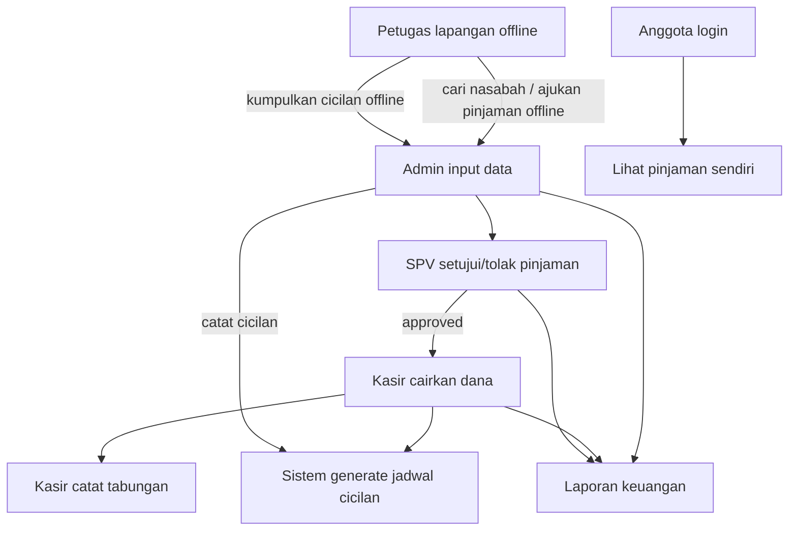

# Analisis & Deskripsi Sistem Karya Tantri Abadi

Dokumen ini mendeskripsikan arsitektur, fitur, hak akses, dan alur bisnis aplikasi **Karya Tantri Abadi** sesuai implementasi sistem terkini. Sistem difokuskan pada **koperasi simpan pinjam berbasis website** (data anggota, tabungan/simpanan, pinjaman kelompok, angsuran, dan laporan keuangan). Modul retail/POS dan SHU **tidak diaktifkan** pada lingkup mitra ini.

> **Istilah formal vs mitra:** Dalam naskah akademik, istilah formal koperasi tetap **simpanan** / **simpan pinjam**. Dalam praktik operasional mitra dan label antarmuka sistem, simpanan disebut **tabungan** karena sifatnya menyerupai menabung. Domain kode tetap `savings` / `SavingResource`.

---

## 1. Stack Teknologi & Arsitektur

* **Framework Backend:** Laravel (PHP 8.2+)
* **Engine UI & Admin Panel:** Filament v3 (Livewire, Alpine.js, Tailwind CSS)
* **Database:** MySQL
* **Pustaka penting:**
  * `spatie/laravel-backup` — backup database
  * `barryvdh/laravel-dompdf` — kuitansi/PDF
  * `maatwebsite/excel` — ekspor laporan
  * Login: email + password 

---

## 2. Multi-Panel & Role

### A. Panel aktif (`app/Providers/Filament/`)

| Panel | Path | Role | Fungsi utama |
| :--- | :--- | :--- | :--- |
| Login | `/auth/login` | semua | Gerbang masuk (email + password) |
| Admin | `/admin` | `admin` | Input pinjaman, catat cicilan, kelola anggota/user, pantau tabungan, laporan, backup, log |
| Kasir | `/kasir` | `kasir` | Cairkan pinjaman, catat tabungan, lihat cicilan (read-only), laporan |
| SPV | `/spv` | `spv` | Setujui/tolak pinjaman, pantau laporan pinjaman/keuangan |
| Anggota | `/anggota` | `anggota` | Lihat pinjaman milik sendiri (read-only) |

Catatan teknis: file provider legacy masih bernama `BendaharaPanelProvider` / `KepalayayasanPanelProvider`, tetapi **ID & path panel aktif** adalah `kasir` dan `spv`.

### B. Redirect setelah login

* `admin` → `/admin`
* `kasir` → `/kasir`
* `spv` → `/spv`
* `anggota` → `/anggota`

### C. Petugas lapangan = offline (bukan user sistem)

Petugas **tidak memiliki akun/panel**. Mereka:

1. mencari/mendampingi nasabah di lapangan
2. mengajukan pinjaman secara offline
3. mengumpulkan cicilan di lapangan
4. menyerahkan uang + data ke admin

Sistem mulai mencatat setelah data diterima pengelola.

Role legacy (`petugas`, `bendahara`, `kepalayayasan`, dll.) dinonaktifkan di seeder dan tidak dipakai operasional.

### D. Siapa anggota

| Istilah | Arti |
| :--- | :--- |
| Nasabah | Sebutan lapangan (orang yang dilayani petugas) |
| Anggota | Nasabah yang sudah terdaftar di koperasi/sistem |

Anggota hanya melihat data pinjaman miliknya. Tidak mengajukan pinjaman di sistem, tidak mencatat cicilan, tidak mengelola tabungan.

---

## 3. Modul & Fitur Utama (Scope Aktif)

### A. Modul Tabungan (domain: Savings)

Label UI: **Tabungan** (formal naskah: simpanan).

* Jenis tabungan dikonfigurasi admin
* Transaksi dicatat **kasir** (admin dapat pantau/edit)
* Kuitansi PDF
* Laporan tabungan (admin/kasir)
* Anggota **tidak** mengelola tabungan di panel

Praktik mitra: tabungan dicatat, diserahkan ke pusat, dan dapat dikembalikan setelah hari raya untuk diputar kembali.

### B. Modul Pinjaman Kelompok (Loans)

Jenis pinjaman aktif: **Kelompok** (jenis lain nonaktif).

| Parameter | Nilai |
| :--- | :--- |
| Plafon max | Rp 5.000.000 |
| Tenor max | 3 bulan |
| Frekuensi | Mingguan (default) / bulanan |
| Biaya angsuran | 11% dari nominal |
| Admin fee | 5% |
| UTJ | 22% |
| Cair bersih | 73% |
| Total dilunasi | nominal + 11% |

Kalkulasi: `App\Services\LoanCalculator`.
Jadwal cicilan digenerate saat **pencairan** oleh kasir.

#### Alur pinjaman

1. Petugas ajukan offline
2. **Admin** input ke sistem (`pending`)
3. **SPV** setujui / tolak
4. **Kasir** cairkan (`disbursed` → jadwal cicilan)
5. **Anggota** hanya lihat

#### Alur cicilan

1. Petugas kumpulkan uang offline
2. Serahkan ke admin
3. **Admin** catat bayar di sistem
4. Kasir hanya **lihat** daftar cicilan

### C. Laporan Keuangan

* Laporan pinjaman
* Laporan tabungan
* Laporan keuangan / arus kas (kategori: Tabungan Anggota, Cicilan Pinjaman, Pencairan Pinjaman, pengeluaran)
* Laporan pengeluaran (admin)

### D. Keamanan & administrasi

* Login email + password 
* Auth log / activity log / data change log (admin)
* Backup database (admin)
* Pengaturan identitas koperasi (`SystemSetting`)

### E. Di luar scope aktif (nonaktif / tidak didaftarkan di panel)

* POS toko / inventaris / penjualan retail
* SHU
* Manajemen jenis pinjaman di UI (jenis tunggal: Kelompok)
* Panel petugas

---

## 4. Struktur Basis Data (inti scope)

| Kategori | Tabel | Deskripsi |
| :--- | :--- | :--- |
| Identitas | `cooperations` | Profil mitra Karya Tantri Abadi |
| Auth & RBAC | `users`, `roles`, `user_roles`, `permissions`, `role_permissions` | User + role aktif admin/spv/kasir/anggota |
| Tabungan | `savings_types`, `savings_transactions` | Jenis & transaksi tabungan |
| Pinjaman | `loan_types`, `loans`, `loan_payments` | Master jenis (Kelompok aktif), pinjaman + fee, jadwal cicilan |
| Keuangan | `expenses`, `expense_categories`, `cash_flows` | Pengeluaran & ringkasan arus kas |
| Log | `auth_logs`, `activity_logs`, `data_change_logs` | Audit |
| Setting | `system_settings` | Konfigurasi |

Kolom fee penting di `loans`: `admin_fee`, `utj_fee`, `installment_fee`, `net_disbursement`, `payment_frequency`, `installment_count`.

Tabel retail/SHU mungkin masih ada di skema legacy, tetapi **tidak dipakai** pada UI aktif mitra ini.

---

## 5. Alur Kerja Utama

### Akun demo (seed)

| Email | Role | Password |
| :--- | :--- | :--- |
| `admin@karya-tantri-abadi.test` | admin | `password` |
| `spv@karya-tantri-abadi.test` | spv | `password` |
| `kasir@karya-tantri-abadi.test` | kasir | `password` |
| `anggota@karya-tantri-abadi.test` | anggota | `password` |

---

## 6. Kesimpulan

Aplikasi **Karya Tantri Abadi** adalah sistem simpan pinjam berbasis website dengan multi-panel Filament. Fokus implementasinya adalah:

1. digitalisasi pencatatan anggota, tabungan, pinjaman kelompok, dan angsuran
2. pemisahan wewenang admin–SPV–kasir–anggota
3. dukungan proses lapangan petugas secara offline tanpa membebani sistem dengan modul sales/CRM

Sistem ini selaras dengan judul skripsi pengembangan koperasi simpan pinjam berbasis website menggunakan metode R&D, dengan penyesuaian istilah mitra (tabungan) pada antarmuka dan batasan scope tanpa POS/SHU.
