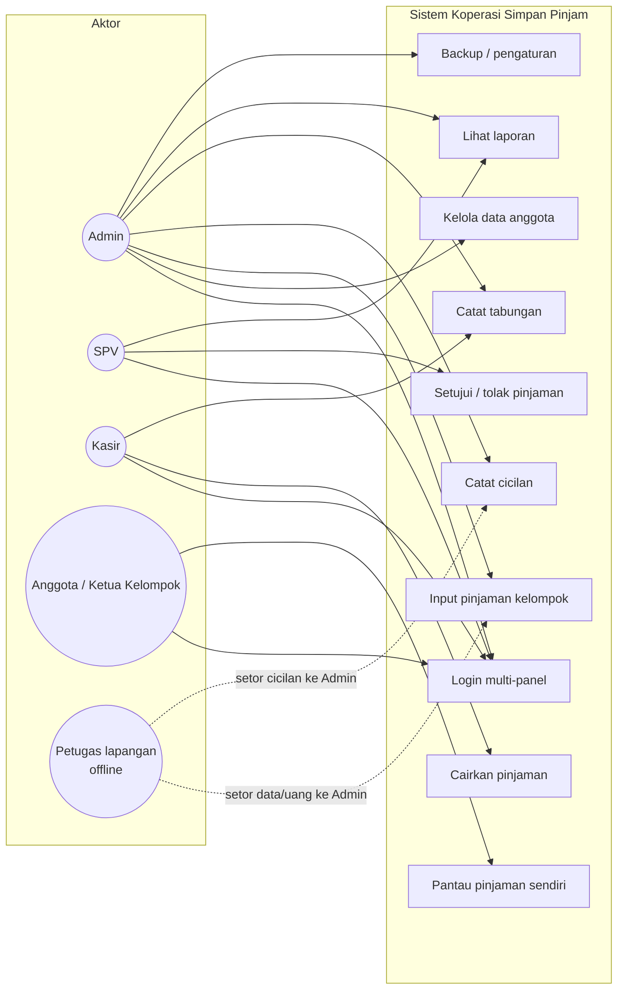
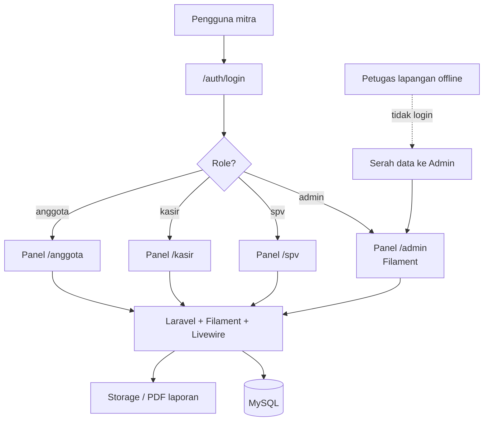
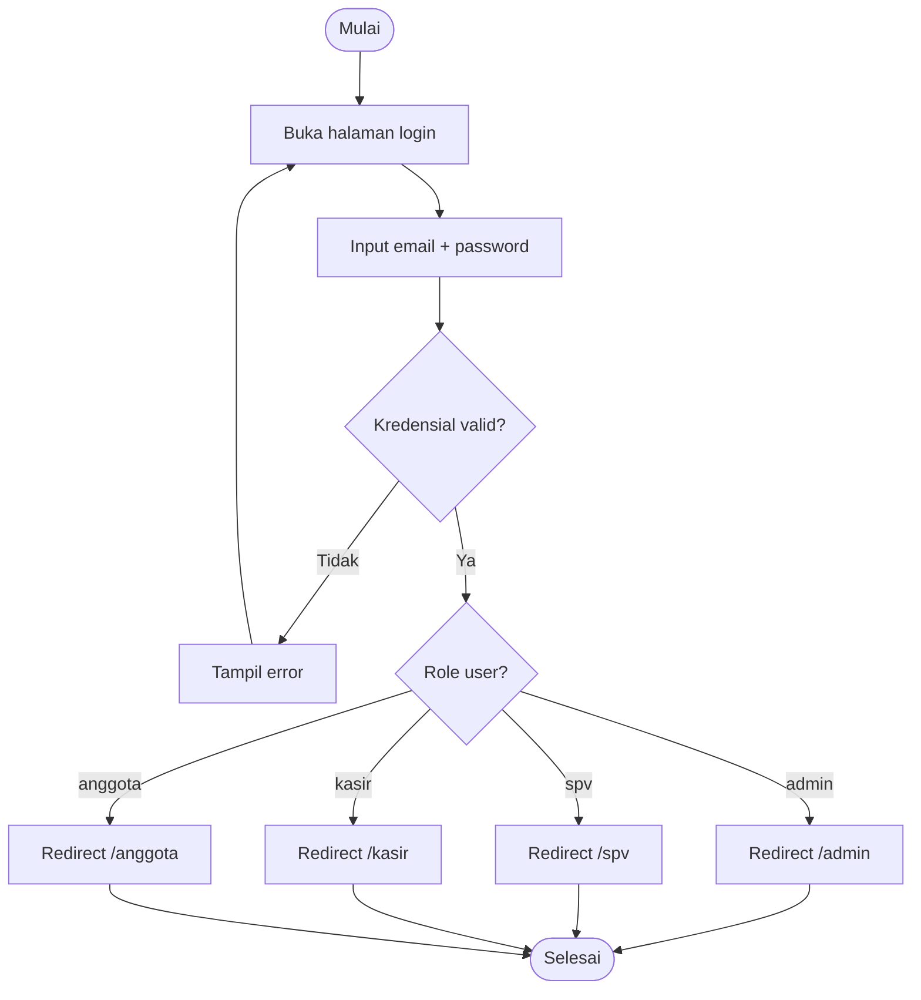
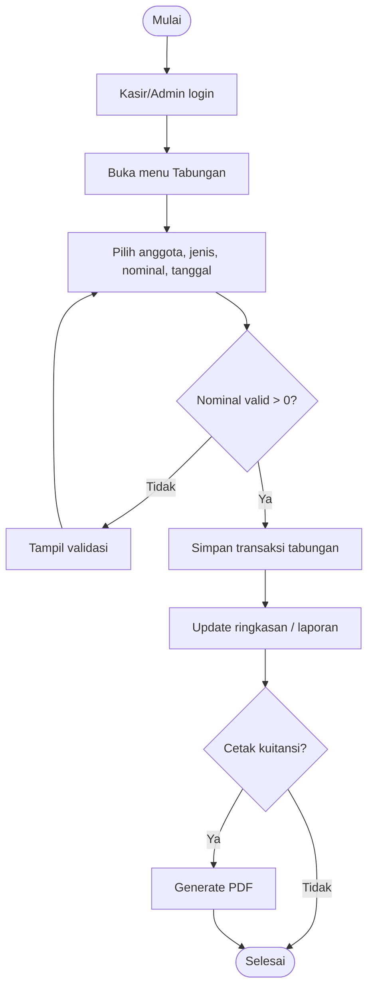
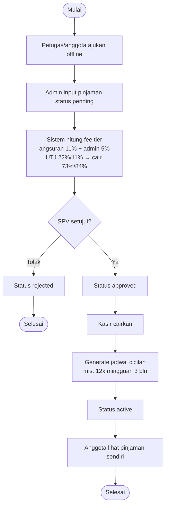
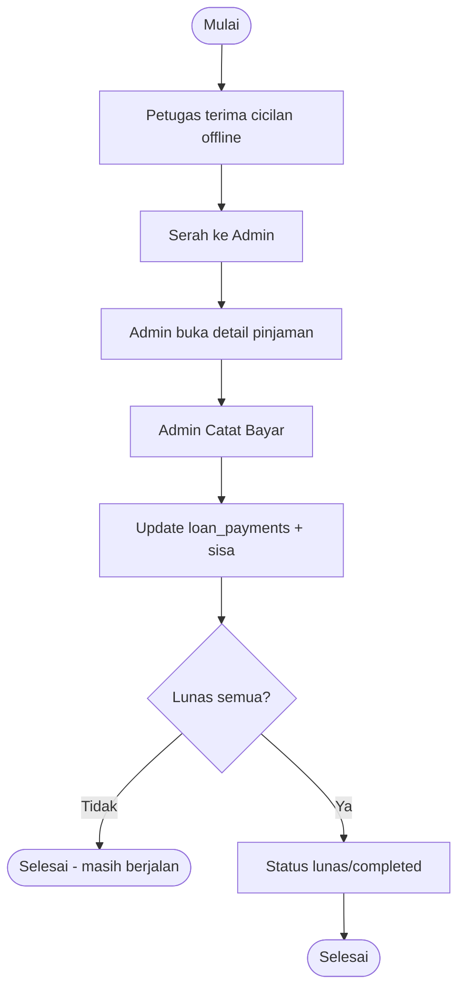
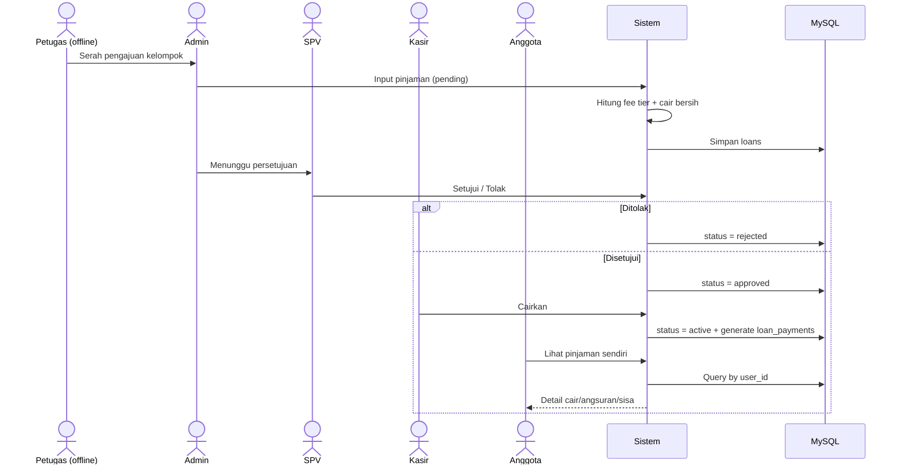
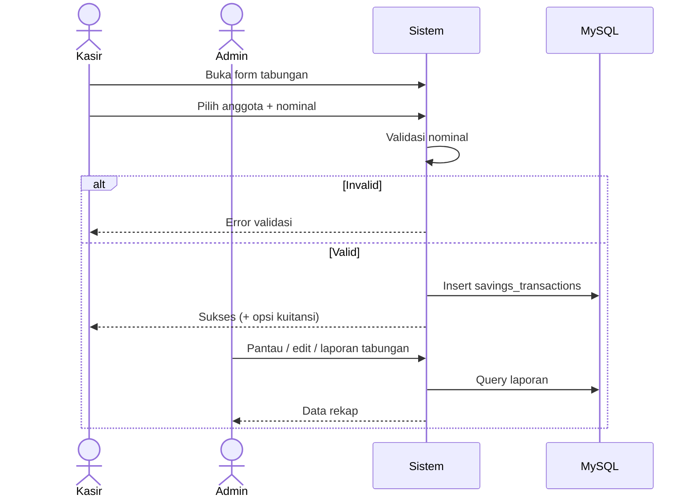
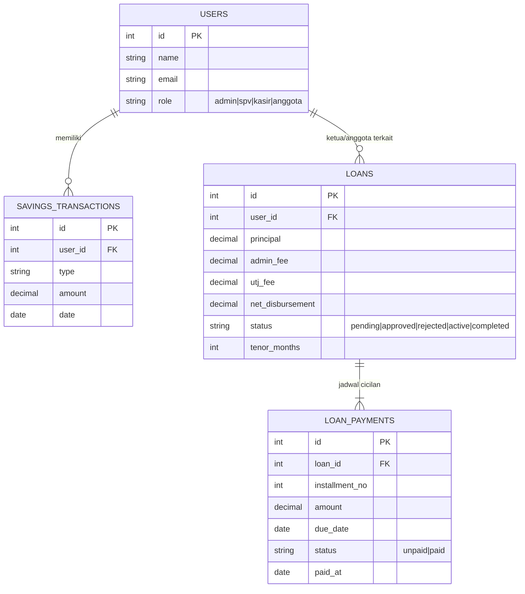
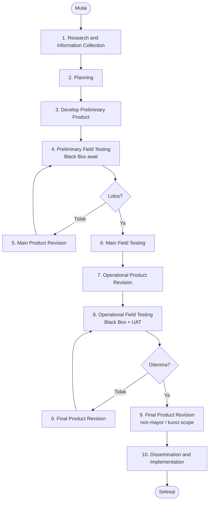

# Diagram Mermaid — Karya Tantri Abadi (sistem final)

Kode Mermaid siap tempel (GitHub / mermaid.live / VS Code).  
Disesuaikan implementasi final: **Admin, SPV, Kasir, Anggota**; petugas **offline**; **tanpa POS/SHU/Bendahara**.

| # | Diagram |
|---|---------|
| 1 | Use Case |
| 2 | Arsitektur multi-panel |
| 3 | Activity — Login |
| 4 | Activity — Tabungan |
| 5 | Activity — Pinjaman kelompok |
| 6 | Activity — Cicilan |
| 7 | Sequence — Pinjaman |
| 8 | Sequence — Tabungan |
| 9 | ERD (logical) |
| 10 | Flowchart R&D 10 tahap |

**Jangan pakai (usang):** activity POS/SHU, UCD Bendahara/Kepala Yayasan, anggota ajukan pinjaman mandiri di sistem.

---

## 1. Use Case Diagram

---

## 2. Arsitektur multi-panel

---

## 3. Activity — Login multi-panel

---

## 4. Activity — Tabungan

---

## 5. Activity — Pinjaman kelompok

---

## 6. Activity — Cicilan

> Kasir/SPV hanya melihat jadwal cicilan; **tidak** mencatat pembayaran.

---

## 7. Sequence — Pinjaman

---

## 8. Sequence — Tabungan

---

## 9. ERD (logical)

---

## 10. Flowchart R&D 10 tahap

---

## Cara pakai

1. Buka [mermaid.live](https://mermaid.live) → tempel satu blok `mermaid`
2. Export PNG/SVG → sisipkan ke `Skripsi.tex` via `\includegraphics`
3. Atau preview di GitHub (file `.md` merender Mermaid)

## Referensi role final

| Role | Panel | Catatan |
|------|-------|---------|
| Admin | `/admin` | Input pinjaman, catat cicilan, tabungan, laporan, backup |
| SPV | `/spv` | Setujui/tolak pinjaman, laporan |
| Kasir | `/kasir` | Tabungan, cairkan pinjaman (tidak catat cicilan) |
| Anggota | `/anggota` | Pantau pinjaman sendiri |
| Petugas | — | Offline; tidak punya akun login |
