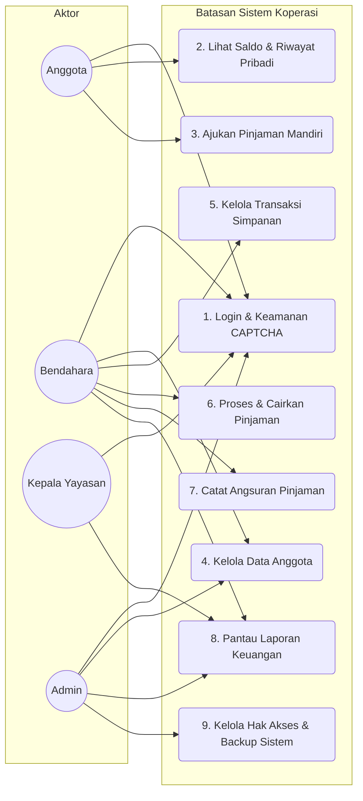
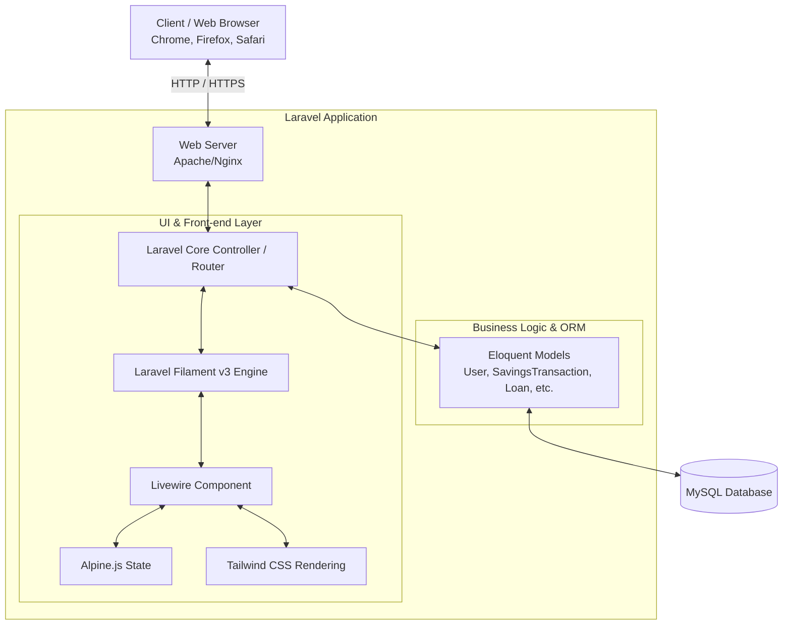
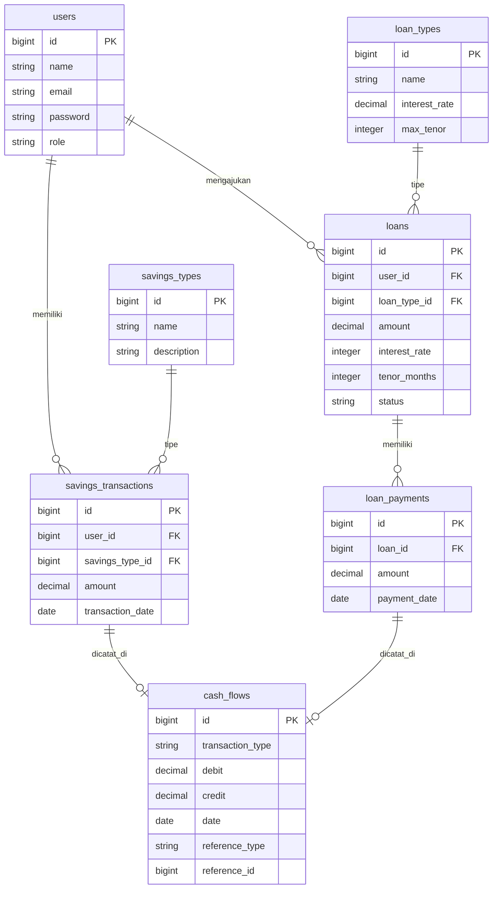
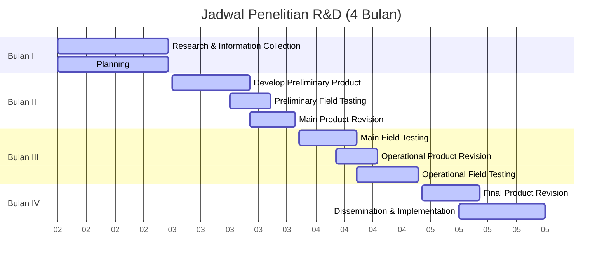

# Analisis & Diagram - Proposal Skripsi Karya Tantri Abadi

Dokumen ini berisi analisis dan visualisasi diagram berdasarkan berkas proposal skripsi **"Pengembangan Sistem Koperasi Simpan Pinjam Berbasis Website Menggunakan Metode Research and Development (Studi Kasus: Karya Tantri Abadi)"** oleh **Adrian Akbar Ramadhani** (NIM **222410102010**).

---

## Daftar Isi Diagram
1. [Diagram Tahapan Penelitian (R&D 10 Langkah)](#1-diagram-tahapan-penelitian-rd-10-langkah)
2. [Use Case Diagram (UCD) Sistem Koperasi](#2-use-case-diagram-ucd-sistem-koperasi)
3. [Arsitektur Sistem (System Architecture)](#3-arsitektur-sistem-system-architecture)
4. [Entity Relationship Diagram (ERD) - Modul Simpan Pinjam](#4-entity-relationship-diagram-erd---modul-simpan-pinjam)
5. [Gantt Chart Jadwal Penelitian (Timeline R&D)](#5-gantt-chart-jadwal-penelitian-timeline-rd)

---

## 1. Diagram Tahapan Penelitian (R&D 10 Langkah)
Berdasarkan deskripsi metodologi di Bab H.4 (halaman 8, 9, 13, dan 14) proposal, metodologi R&D yang digunakan terdiri dari 10 tahap berurutan dan iteratif.

```mermaid
flowchart TD
    Start([Mulai]) --> Step1[1. Research and Information Collection\n- Studi literatur & observasi\n- Analisis masalah & kebutuhan awal]
    Step1 --> Step2[2. Planning\n- Perumusan tujuan penelitian & jadwal\n- Penentuan infra teknologi & deskripsi tugas]
    Step2 --> Step3[3. Develop Preliminary Product\n- Perancangan sistem (ERD, AD, SD)\n- Pembuatan prototipe fungsional (Laravel)]
    Step3 --> Step4[4. Preliminary Field Testing\n- Uji coba skala kecil terbatas\n- Pengujian Black Box & Usabilitas awal]
    Step4 --> Step5[5. Main Product Revision\n- Perbaikan dari umpan balik uji terbatas\n- Pembenahan aspek fungsionalitas & kegunaan]
    Step5 --> Step6[6. Main Field Testing\n- Uji coba lapangan lebih luas\n- Pengujian efektivitas & kinerja sistem]
    Step6 --> Step7[7. Operational Product Revision\n- Perbaikan lanjut pasca uji utama\n- Peningkatan stabilitas performa sistem]
    Step7 --> Step8[8. Operational Field Testing\n- Uji coba skala besar kondisi nyata\n- Evaluasi kuesioner UAT (User Acceptance Testing)]
    Step8 --> Step9[9. Final Product Revision\n- Penyempurnaan akhir hasil UAT\n- Penjaminan standar kualitas perangkat lunak]
    Step9 --> Step10[10. Dissemination & Implementation\n- Publikasi artikel ilmiah\n- Penerapan penuh di Koperasi Yayasan]
    Step10 --> End([Selesai])
```

---

## 2. Use Case Diagram (UCD) Sistem Koperasi
Memetakan aktor-aktor yang terlibat (Admin, Bendahara, Anggota, Kepala Yayasan) serta interaksi fungsional mereka terhadap sistem.



---

## 3. Arsitektur Sistem (System Architecture)
Menunjukkan struktur komponen teknologi yang digunakan dalam pengembangan web koperasi simpan pinjam berbasis Laravel & Filament.



---

## 4. Entity Relationship Diagram (ERD) - Modul Simpan Pinjam
Skema basis data relasional tingkat tinggi untuk modul utama (Anggota, Simpanan, Pinjaman, dan Arus Kas Keuangan).



---

## 5. Gantt Chart Jadwal Penelitian (Timeline R&D)
Visualisasi dari *Table 2 Jadwal Penelitian* (halaman 18 dan 19) proposal, membagi 10 tahapan penelitian R&D ke dalam alokasi waktu 4 bulan (Februari - Mei 2026).


