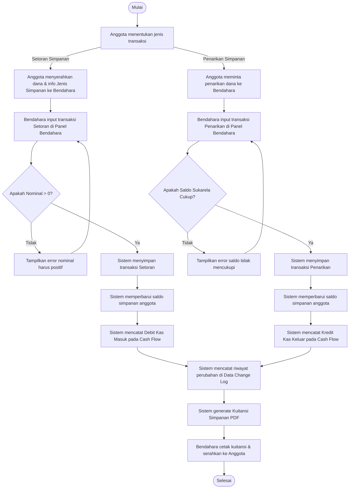
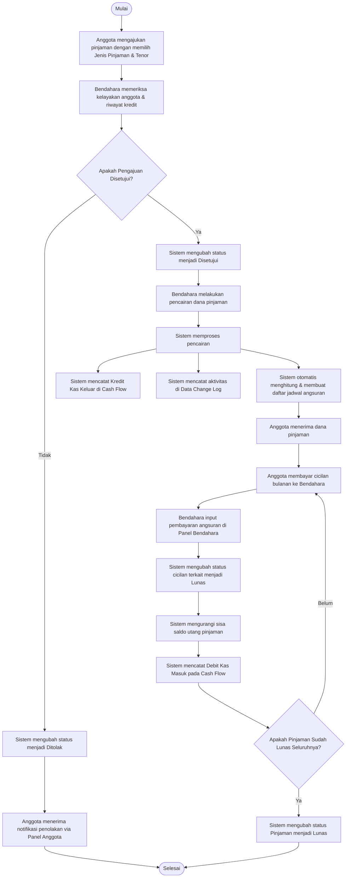
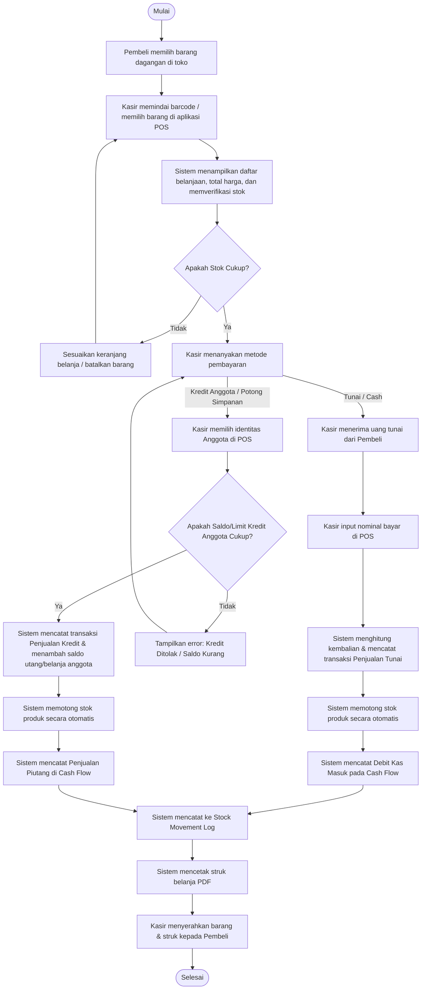
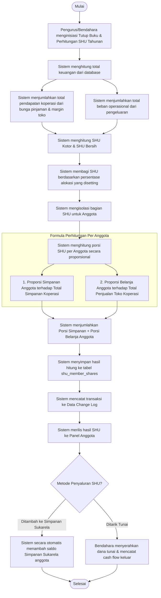

# Activity Diagram - Sistem Koperasi Karya Tantri Abadi

Dokumen ini berisi rangkaian **Activity Diagram** yang memodelkan alur kerja (*workflows*) utama dari aplikasi **Koperasi Karya Tantri Abadi**. Setiap diagram digambarkan menggunakan notasi UML Activity Diagram standar berbasis **Mermaid.js**, memisahkan proses berdasarkan peran aktor (*swimlanes/roles*) dan logika sistem.

---

## Daftar Isi
1. [Activity Diagram: Transaksi Simpanan (Setoran & Penarikan)](#1-activity-diagram-transaksi-simpanan-setoran--penarikan)
2. [Activity Diagram: Pengajuan & Angsuran Pinjaman](#2-activity-diagram-pengajuan--angsuran-pinjaman)
3. [Activity Diagram: Transaksi Retail (POS) Toko Koperasi](#3-activity-diagram-transaksi-retail-pos-toko-koperasi)
4. [Activity Diagram: Perhitungan & Pembagian Sisa Hasil Usaha (SHU)](#4-activity-diagram-perhitungan--pembagian-sisa-hasil-usaha-shu)

---

## 1. Activity Diagram: Transaksi Simpanan (Setoran & Penarikan)
Diagram ini menjelaskan bagaimana Anggota melakukan transaksi simpanan (Setoran Pokok, Wajib, Sukarela) atau melakukan penarikan dana simpanan Sukarela yang diproses oleh Bendahara di Panel Bendahara.

### Penjelasan Alur:
1. **Pilihan Transaksi:** Transaksi dibagi menjadi dua alur utama: Setoran dan Penarikan.
2. **Validasi Setoran:** Nominal setoran wajib bernilai positif (> 0).
3. **Validasi Penarikan:** Penarikan hanya diperbolehkan jika saldo jenis simpanan (biasanya simpanan sukarela) mencukupi nominal penarikan yang diminta.
4. **Pencatatan Keuangan (Cash Flow):** Setiap transaksi simpanan secara otomatis menghasilkan jurnal kas masuk (Debit) atau kas keluar (Kredit) secara real-time.
5. **Audit Trail:** Sistem mencatat snapshot data sebelum dan setelah diubah ke dalam `data_change_logs`.
6. **Output:** Kuitansi PDF dicetak menggunakan library DomPDF sebagai bukti transaksi fisik yang sah bagi anggota.

---

## 2. Activity Diagram: Pengajuan & Angsuran Pinjaman
Diagram ini menggambarkan siklus hidup pinjaman anggota, mulai dari pengajuan pinjaman, persetujuan dan pencairan oleh bendahara, hingga proses angsuran bulanan sampai pinjaman lunas.

### Penjelasan Alur:
1. **Pengajuan:** Anggota memilih nominal, tipe bunga/syarat (`loan_types`), dan tenor (jangka waktu pembayaran).
2. **Review:** Bendahara bertindak sebagai verifikator kelayakan anggota.
3. **Pencairan & Amortisasi:** Ketika status diubah menjadi cair (disetujui), sistem secara otomatis mengkalkulasi jadwal angsuran (angsuran pokok, bunga, tanggal jatuh tempo) dan memotong kas koperasi sebesar nilai pokok pinjaman.
4. **Pembayaran Angsuran:** Pembayaran dilakukan berkala. Setiap kali angsuran dibayar, status angsuran bulan bersangkutan ditandai lunas, nominal utang berkurang, dan arus kas masuk dicatat.
5. **Pelunasan Akhir:** Pinjaman dinyatakan selesai (Lunas) setelah seluruh jadwal angsuran terpenuhi.

---

## 3. Activity Diagram: Transaksi Retail (POS) Toko Koperasi
Diagram ini menggambarkan alur kerja modul Kasir/Point of Sales (POS) Toko Koperasi, yang mendukung pembayaran tunai dan pembayaran kredit potong gaji/simpanan bagi anggota koperasi.

### Penjelasan Alur:
1. **Input POS:** Kasir memindai barang menggunakan scanner barcode atau memilih secara manual. Sistem melakukan validasi stok real-time (`products.stock`).
2. **Metode Tunai:** Pembeli umum atau anggota membayar langsung secara tunai. Kas masuk langsung didebit pada sistem akuntansi.
3. **Metode Kredit:** Anggota dapat berbelanja secara kredit (potong gaji bulanan/potong saldo simpanan). Sistem akan memvalidasi apakah batas limit kredit anggota atau saldo simpanannya mencukupi untuk melakukan pembelian.
4. **Manajemen Stok Otomatis:** Setiap transaksi sukses memicu pengurangan stok fisik barang secara otomatis dan mencatat histori keluar-masuk barang pada tabel `stock_movement_logs`.
5. **Struk PDF:** Struk belanja digenerate menggunakan format struk thermal mini dan dicetak langsung.

---

## 4. Activity Diagram: Perhitungan & Pembagian Sisa Hasil Usaha (SHU)
Diagram ini menjelaskan bagaimana pengurus melakukan kalkulasi tahunan pembagian SHU (Sisa Hasil Usaha) koperasi secara transparan dan proporsional kepada seluruh anggota.

### Penjelasan Alur:
1. **Tutup Buku:** Proses ini biasanya dilakukan satu kali di akhir periode tahun buku koperasi.
2. **Kalkulasi Laba-Rugi Bersih:** Sistem mengambil pendapatan bunga pinjaman dan laba bersih retail toko dikurangi pengeluaran operasional koperasi (`expenses`).
3. **Pembagian Porsi SHU:** Porsi SHU dibagi ke beberapa pos alokasi (Cadangan Koperasi, Jasa Anggota, Pengurus, Pengawas, Yayasan) sesuai persentase regulasi koperasi pada `shu_distributions`.
4. **Formula Keadilan Partisipasi Anggota:**
   - **Partisipasi Modal (Simpanan):** Semakin besar total simpanan seorang anggota dibanding anggota lain, semakin besar porsi SHU jasa simpanan yang diterimanya.
   - **Partisipasi Usaha (Belanja Toko):** Semakin aktif anggota berbelanja di unit toko koperasi, semakin besar porsi SHU jasa transaksi retail yang didapatkannya.
5. **Pencatatan:** Hasil final disimpan di `shu_member_shares` untuk transparansi laporan. Anggota dapat melihat rincian SHU tahunan mereka melalui dashboard pribadi.
6. **Reinvestasi atau Likuidasi:** Anggota dapat memilih untuk memasukkan SHU langsung ke saldo Simpanan Sukarela mereka atau mencairkannya dalam bentuk tunai.
