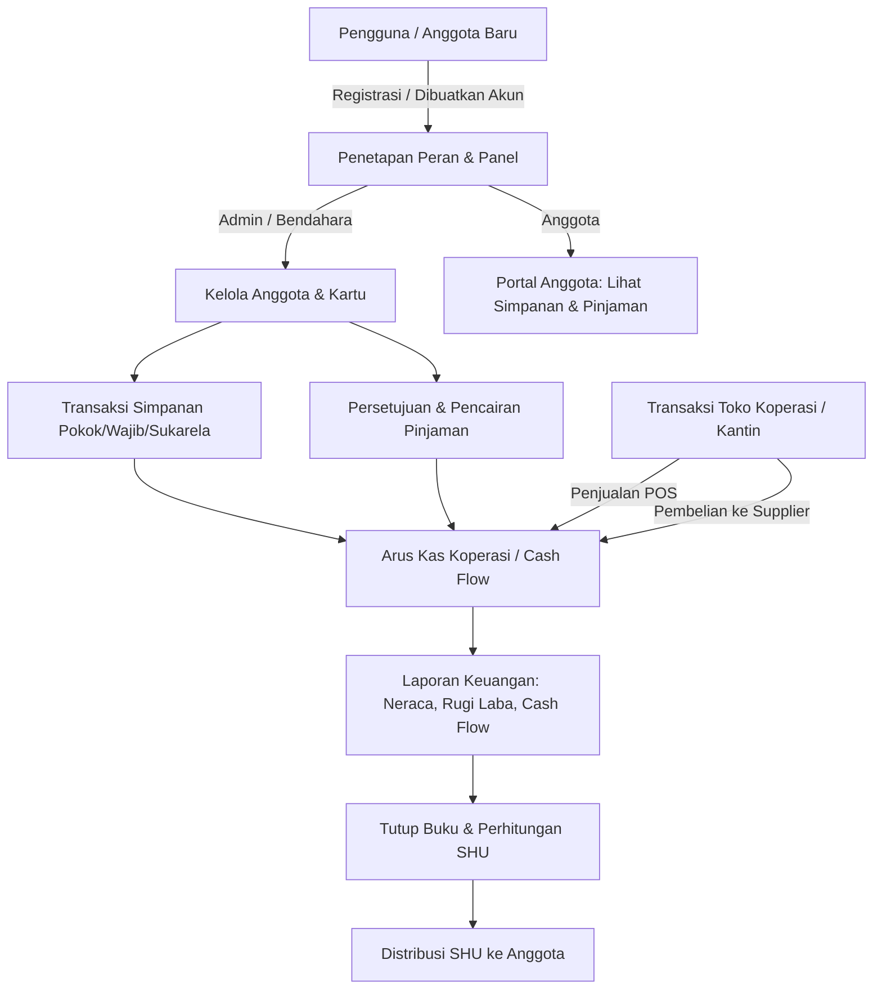

# Analisis & Deskripsi Sistem Koperasi Karya Tantri Abadi

Dokumen ini berisi analisis mendalam mengenai arsitektur, teknologi, fitur, dan struktur basis data dari aplikasi **Koperasi Karya Tantri Abadi**. Aplikasi ini merupakan platform ERP/Manajemen Koperasi berbasis web yang komprehensif, dirancang untuk mengelola keanggotaan, simpan-pinjam, unit usaha retail (toko/kantin), keuangan, audit log, hingga pembagian Sisa Hasil Usaha (SHU).

---

## 1. Stack Teknologi & Arsitektur Sistem

Aplikasi Koperasi Karya Tantri Abadi dikembangkan menggunakan framework PHP modern dan arsitektur panel admin yang efisien:

*   **Framework Backend:** Laravel v12.0 (PHP ^8.2)
*   **Engine UI & Admin Panel:** Filament v3.3 (menggunakan PHP, Livewire, Alpine.js, dan Tailwind CSS)
*   **Asset Bundler & Styling:** Vite dengan Tailwind CSS v4.0.0
*   **Integrasi Pihak Ketiga & Library Penting:**
    *   `spatie/laravel-backup` (v9.3.4) – Untuk otomatisasi dan manajemen backup/restore database.
    *   `barryvdh/laravel-dompdf` (v3.1) – Untuk render dokumen PDF (cetak Kartu Anggota, Kuitansi Simpanan, Struk Penjualan).
    *   `maatwebsite/excel` (v3.1) – Untuk ekspor berbagai laporan keuangan dan inventaris ke format Excel (.xlsx).
    *   `anhskohbo/no-captcha` (v3.7) – Integrasi reCAPTCHA untuk keamanan halaman login.

---

## 2. Multi-Panel & Manajemen Hak Akses (RBAC)

Sistem ini menerapkan konsep **Multi-Panel** di Filament, memisahkan lingkungan kerja pengguna berdasarkan peran (Role) mereka demi keamanan dan fokus antarmuka.

### A. Panel yang Tersedia (`app/Providers/Filament/`)
1.  **Panel Login (`LoginPanelProvider.php`)**: Halaman gerbang masuk utama dengan kustomisasi login (`CustomLogin.php`) dan pengamanan CAPTCHA.
2.  **Panel Admin (`AdminPanelProvider.php`)**: Panel dengan akses penuh bagi Administrator sistem untuk mengelola parameter koperasi, hak akses, backup data, dan seluruh aktivitas log.
3.  **Panel Bendahara (`BendaharaPanelProvider.php`)**: Panel kerja khusus untuk transaksi simpanan, persetujuan dan pencairan pinjaman, pembayaran angsuran, serta pelaporan keuangan harian/bulanan.
4.  **Panel Anggota (`AnggotaPanelProvider.php`)**: Halaman portal mandiri untuk anggota koperasi guna melihat saldo simpanan, riwayat pinjaman, dan struk belanjaan mereka di toko koperasi secara real-time.
5.  **Panel Kepala Yayasan (`KepalayayasanPanelProvider.php`)**: Panel dashboard eksekutif untuk melihat laporan ringkasan keuangan, laporan rugi-laba, dan memantau kesehatan finansial koperasi tanpa izin melakukan manipulasi data transaksi.

### B. Role-Based Access Control (RBAC)
Hak akses diatur secara granular menggunakan tabel roles dan permissions. Middleware kustom (`check-auth-redirect` di [web.php](file:///home/adrianakbar/Pribadi/Portofolio/skripsi/karya-tantri-abadi/routes/web.php)) akan membaca peran pengguna yang login dan otomatis mengarahkan ke panel yang sesuai:
*   `admin` $\rightarrow$ `/admin`
*   `anggota` $\rightarrow$ `/anggota/simpanan`
*   `bendahara` $\rightarrow$ `/bendahara`
*   `kepala_yayasan` / `kepalayayasan` $\rightarrow$ `/kepalayayasan/financial-report`

---

## 3. Modul & Fitur Utama Aplikasi

Sistem Koperasi Karya Tantri Abadi memiliki fitur ERP koperasi yang sangat lengkap, yang terbagi dalam modul-modul berikut:

### 🪙 Modul Simpanan (Savings)
*   **Jenis Simpanan:** Mendukung konfigurasi dinamis berbagai jenis simpanan (misal: Simpanan Pokok, Simpanan Wajib, Simpanan Sukarela).
*   **Transaksi:** Pencatatan setoran dan penarikan simpanan anggota secara presisi.
*   **Cetak Kuitansi:** Integrasi cetak bukti kuitansi transaksi simpanan menggunakan PDF.
*   **Laporan & Statistik:** Grafik dan rekapan simpanan bulanan/tahunan untuk bendahara.

### 💸 Modul Pinjaman & Pembiayaan (Loans)
*   **Jenis Pinjaman:** Pengaturan tenor, suku bunga, dan batas maksimal pinjaman.
*   **Manajemen Pinjaman:** Pengajuan pinjaman, kalkulasi jadwal angsuran otomatis, status persetujuan, dan pencatatan pembayaran cicilan.
*   **Laporan Pinjaman:** Pemantauan piutang anggota dan status kelancaran pembayaran angsuran.

### 🛒 Modul Inventaris & Retail (POS Toko Koperasi)
Koperasi memiliki unit bisnis toko/kantin yang terintegrasi penuh:
*   **Manajemen Produk:** Manajemen katalog produk lengkap dengan barcode/kode barang, stok, harga beli, harga jual, dan kategori produk.
*   **Pembelian (Purchasing):** Pencatatan pasokan barang dari supplier untuk restock gudang.
*   **Penjualan (Sales/POS):** Kasir penjualan retail kepada anggota koperasi atau pelanggan umum dengan fitur cetak struk PDF.
*   **Penyesuaian Stok (Stock Adjustment):** Fitur stock opname untuk menyesuaikan jumlah fisik barang dengan sistem.
*   **Log Pergerakan Stok (Stock Movement Log):** Pelacakan otomatis setiap kali stok barang masuk, keluar, terjual, atau disesuaikan.

### 📊 Modul Sisa Hasil Usaha (SHU)
*   **Alokasi SHU:** Pengaturan persentase alokasi SHU tahunan untuk dana cadangan, pengurus, anggota, yayasan, dll.
*   **Distribusi Anggota:** Perhitungan pembagian SHU per anggota secara adil berdasarkan proporsi total simpanan dan aktivitas belanja anggota di toko koperasi.
*   **Laporan SHU:** Detail laporan pembagian SHU yang transparan dan dapat diekspor.

### 📈 Laporan Keuangan & Akuntansi (Financial Reports)
Aplikasi menghasilkan laporan keuangan komprehensif secara otomatis:
*   **Laporan Arus Kas (Cash Flow):** Pencatatan setiap kas masuk dan keluar dari semua modul (simpanan, pinjaman, penjualan retail, pembelian supplier, pengeluaran operasional).
*   **Laporan Rugi Laba (Income/Revenue Report):** Analisis pendapatan bersih dari margin toko dan bunga pinjaman dikurangi beban pengeluaran.
*   **Laporan Pengeluaran (Expense Report):** Klasifikasi pengeluaran operasional koperasi berdasarkan kategori.
*   **Laporan Neraca / Keuangan Utama (Financial Report):** Informasi total aset, kewajiban (liabilitas), dan ekuitas koperasi.

### 🛡️ Keamanan, Audit & Pengaturan Sistem
*   **Audit Trail:**
    *   `AuthLog`: Riwayat login, alamat IP, dan perangkat yang digunakan pengguna.
    *   `ActivityLog`: Pencatatan aktivitas umum pengguna di dashboard.
    *   `DataChangeLog`: Riwayat perubahan data di database (mencatat data sebelum dan sesudah diedit untuk keamanan audit).
*   **Sistem Backup:** Backup database otomatis terjadwal atau manual yang dapat diunduh langsung dari panel admin.
*   **Pengaturan Fleksibel:** Pengaturan tema warna antarmuka (UI theme), identitas koperasi (nama, logo, alamat), limit finansial, dan parameter sistem lainnya melalui model `SystemSetting`.

---

## 4. Struktur Basis Data (Schema DB)

Berdasarkan berkas migrasi database (`database/migrations/`), tabel-tabel utama penyusun sistem didefinisikan sebagai berikut:

| Kategori Tabel | Nama Tabel | Deskripsi |
| :--- | :--- | :--- |
| **Identitas Koperasi** | `cooperations` | Menyimpan profil dan identitas badan hukum Koperasi Karya Tantri Abadi. |
| **Autentikasi & RBAC** | `users` | Data pengguna sistem (pengurus, anggota, admin). |
| | `roles` | Daftar peran/hak akses (admin, bendahara, manajer, kepala yayasan, anggota). |
| | `user_roles` | Relasi banyak-ke-banyak (*many-to-many*) antara user dan role. |
| | `permissions` | Izin akses spesifik (misal: `view_dashboard`, `manage_members`). |
| | `role_permissions` | Pemetaan izin akses yang dimiliki oleh setiap role. |
| **Simpanan** | `savings_types` | Master tipe simpanan (pokok, wajib, sukarela, dll). |
| | `savings_transactions` | Detail mutasi setoran dan penarikan simpanan anggota. |
| **Pinjaman** | `loan_types` | Master tipe pinjaman (syarat, bunga, jangka waktu). |
| | `loans` | Rekam pengajuan dan status pinjaman aktif anggota. |
| | `loan_payments` | Pembayaran angsuran bulanan/mingguan dari pinjaman. |
| **Inventaris & Retail**| `product_categories` | Kategori barang dagangan di toko koperasi. |
| | `products` | Katalog produk, harga beli/jual, dan jumlah stok. |
| | `suppliers` | Data supplier tempat koperasi membeli produk retail. |
| | `purchases` & `purchase_details` | Riwayat pembelian dan stok masuk dari supplier. |
| | `sales` & `sale_details` | Riwayat penjualan kasir (POS) toko koperasi. |
| | `stock_adjusments` & `_details` | Penyesuaian jumlah stok fisik (stock opname). |
| **Keuangan** | `expenses` & `_categories` | Pencatatan beban biaya operasional koperasi. |
| | `cash_flows` | Jurnal arus kas umum (debit/kredit) dari semua aktivitas. |
| | `shu_distributions` | Pengaturan pembagian persentase SHU tahunan. |
| | `shu_member_shares` | Hasil hitung SHU per anggota di akhir tahun. |
| **Pengaturan & Log** | `system_settings` | Konfigurasi global sistem (kategori: general, ui_theme, financial, dll). |
| | `system_configurations` | Flag konfigurasi tingkat lanjut. |
| | `reports` | Metadata berkas laporan yang telah digenerate. |
| | `auth_logs` | Log histori login dan logout. |
| | `activity_logs` | Log aktivitas pengguna pada sistem. |
| | `data_change_logs` | Log perubahan record data tabel (Audit Trail). |
| | `stock_movement_logs` | Rekam jejak keluar-masuk stok barang. |

---

## 5. Alur Kerja Utama Sistem (Workflows)

### Kesimpulan
Aplikasi **Koperasi Karya Tantri Abadi** dirancang dengan sangat baik menggunakan pendekatan modular berbasis **Filament Multi-panel**. Sistem ini tidak hanya berfokus pada aktivitas simpan-pinjam tradisional, melainkan juga menyertakan fungsionalitas mini-ERP retail (pembelian, penjualan, manajemen stok, dan supplier) serta sistem akuntansi yang solid (log mutasi kas otomatis dan audit log data). Hal ini menjadikannya solusi digital yang andal dan aman untuk manajemen koperasi modern.
