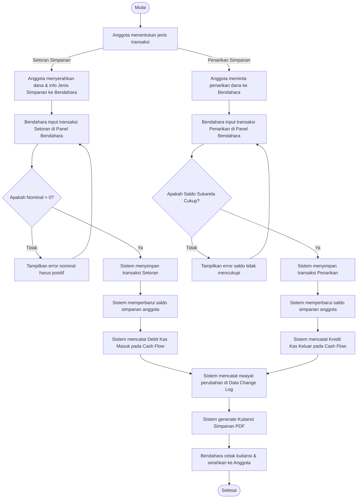

# Activity Diagrams - Koperasi Karya Tantri Abadi

Dokumen ini berisi rangkuman **Activity Diagram** yang dirancang untuk memetakan alur kerja utama aplikasi **Koperasi Karya Tantri Abadi**. Rincian lengkap beserta penjelasan teknis telah dibuat langsung di dalam repositori proyek Anda pada file [ACTIVITY_DIAGRAM.md](file:///home/adrianakbar/Pribadi/Portofolio/skripsi/karya-tantri-abadi/ACTIVITY_DIAGRAM.md).

Berikut adalah ringkasan modul-modul yang dibuatkan diagram aktivitasnya:

| Modul | Peran/Aktor | Deskripsi Alur |
| :--- | :--- | :--- |
| **1. Simpanan (Savings)** | Anggota, Bendahara, Sistem | Alur setoran simpanan (pokok/wajib/sukarela) dan penarikan simpanan sukarela, validasi saldo, pencatatan otomatis ke jurnal arus kas (cash flow), audit trail (`data_change_logs`), serta pengeluaran bukti kuitansi PDF. |
| **2. Pinjaman (Loans)** | Anggota, Bendahara, Sistem | Alur lengkap pengajuan pinjaman, pengecekan kelayakan, persetujuan/penolakan, pencairan, pembuatan jadwal amortisasi angsuran otomatis, hingga pembayaran cicilan bulanan sampai status pinjaman lunas. |
| **3. Toko & Retail (POS)** | Pembeli/Anggota, Kasir, Sistem | Alur Point of Sales (POS) retail toko koperasi. Mendukung pembayaran Tunai (Cash) dan Penjualan Kredit Anggota (potong gaji/utang anggota), validasi stok fisik, pemotongan stok otomatis, log pergerakan stok, dan cetak struk belanja thermal. |
| **4. Pembagian SHU** | Pengurus/Bendahara, Sistem | Proses akhir tahun (tutup buku) yang menghitung pendapatan kotor dan bersih, mengalokasikan persentase SHU, serta membagikannya secara proporsional kepada anggota berdasarkan partisipasi simpanan dan total belanja toko. |

---

## Cuplikan Diagram Alur Utama (Mermaid)

### 🪙 Transaksi Simpanan (Setoran & Penarikan)

---

> [!NOTE]
> File lengkap [ACTIVITY_DIAGRAM.md](file:///home/adrianakbar/Pribadi/Portofolio/skripsi/karya-tantri-abadi/ACTIVITY_DIAGRAM.md) telah sukses dibuat di direktori utama proyek Anda dan siap diakses atau diintegrasikan ke sistem dokumentasi tim pengembang.
